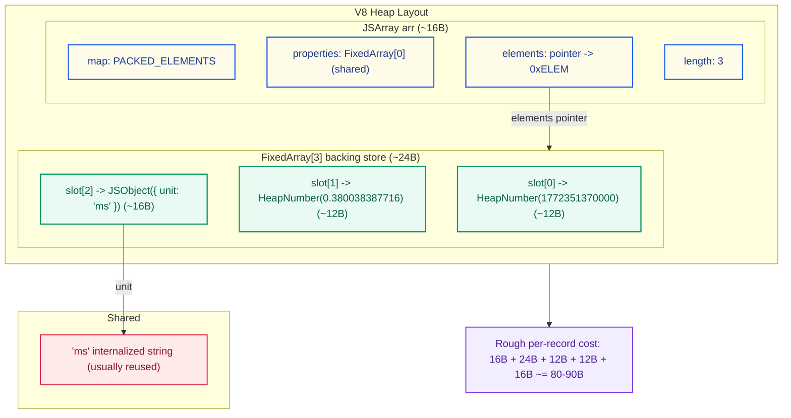
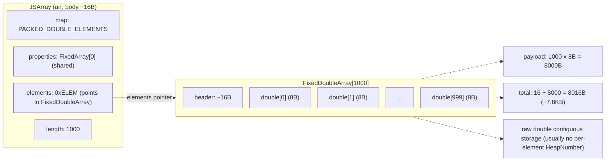

## The Trigger: Memory Pressure

During my internship at ByteDance, I worked on a memory optimization task in late July. A neighboring product team hit a white-screen issue. According to customer feedback, once they embedded more than ten charts on a page and loaded one month of data, the browser became unresponsive. After investigation, we confirmed the root cause was excessive memory usage that eventually crashed the browser. The task was assigned to me to see whether we could fix it.

## Existing Data Structure: Why Memory Blew Up

I was on an observability team. The backend returned data mostly in Grafana DataFrame format. Internally, we had a shared chart library to provide a consistent charting experience across observability products: it had to be compatible with Grafana DataFrame while also matching Volcengine's design system.


The component I optimized was a time-series chart. Visualization often means large objects and large arrays, so my first instinct was to optimize the data structure itself.

The original scenario can be abstracted as:

- One chart renders **m lines**
- Each line contains **n points**
- Each point carries `(x, y)` plus meta info (for tooltips, annotations, etc.)

The chart library parsed DataFrame and converted it into ECharts `series`, so the data looked roughly like this, with each point represented as a tuple:

```js
series: [
  {
    type: "line",
    // "lineStyle","areaStyle", "name", "connectNulls" ...
    data: [[x1, y1, meta1], [x2, y2, meta2], ...]
  },
  {
    type: "line",
    data: [[x1, y1, meta1], [x2, y2, meta2], ...]
  },
];
```

## Memory Cost of Tuples (with V8 Details)

> This section includes some V8 internals.

Recommended reading:

- [Inside V8 - how memory is allocated for JS arrays](https://juejin.cn/post/7004038556750446623)
- [Elements kinds in V8](https://v8.dev/blog/elements-kinds)

Example data points:

```json
[[1772351340000, 0.348785871965, { "unit": "ms" }],
 [1772351370000, 0.380038387716, { "unit": "ms" }], ...]
// index: 0                1              2
// type:  HeapNumber   HeapNumber       Object
```

The structure is effectively a 3D array: each point is `[x, y, metaObj]`. `metaObj` is an object with `q` fields (string/number/boolean/enum, etc.).

### Why Mixed-Type Arrays Are More Expensive

> In V8, arrays (JSArray) can be in fast or slow mode. Slow arrays use hash-table storage. Every JS array is associated with an element kind, metadata V8 tracks to optimize array operations. In this scenario, element kind is the relevant factor.

V8 classifies numbers into `Smi` (small integers) and `HeapNumber`. `Smi` is more efficient and can be inlined (4B with pointer compression). Any value beyond 31/32-bit integer range or any floating-point number is stored as `HeapNumber`, typically 12B each.

V8 chooses different elements kinds based on element types. Pure numeric arrays can use `PACKED_DOUBLE_ELEMENTS`, which stores raw doubles contiguously. Mixed-type arrays usually degrade to `PACKED_ELEMENTS`, which is a tagged pointer array and introduces more object allocation plus more GC pressure.

For each point in our time-series data:

- `x` is a 13-digit timestamp, outside SMI range -> **HeapNumber**
- `y` is a float -> **HeapNumber**
- `meta` is an object -> **JSObject**

So `[x, y, meta]` uses `PACKED_ELEMENTS`.

Let's verify this with `debug-v8`.

```bash
% ./v8/d8  --allow-natives-syntax
V8 version 14.7.126.1
d8> const arr = [1772351340000, 0.348785871965, { unit: "ms" }];
undefined
d8> %DebugPrint(arr);
DebugPrint: 0x15de0104b611: [JSArray]
 - map: 0x15de01028955 <Map[16](PACKED_ELEMENTS)> [FastProperties]
 - prototype: 0x15de01028231 <JSArray[0]>
 - elements: 0x15de0104b5cd <FixedArray[3]> [PACKED_ELEMENTS]
 - length: 3
 - properties: 0x15de000007bd <FixedArray[0]>
 - All own properties (excluding elements): {
    0x15de00000df1: [String] in ReadOnlySpace: #length: 0x15de00887699 <AccessorInfo name= 0x15de00000df1 <String[6]: #length>, data= 0x15de00000011 <undefined>> (const accessor descriptor, attrs: [W__])
 }
 - elements: 0x15de0104b5cd <FixedArray[3]> {
           0: 0x15de01039acd <HeapNumber 1772351340000.0>
           1: 0x15de01039ad9 <HeapNumber 0.348786>
           2: 0x15de0104b5e1 <Object map = 0x15de01039b8d>
 }
0x15de01028955: [Map] in OldSpace
 - map: 0x15de01020131 <MetaMap (0x15de01020181 <NativeContext[306]>)>
 - type: JS_ARRAY_TYPE
 - instance size: 16
```

### 1) What storage shape do these three elements use?

From the `%DebugPrint` output, the tuple is:

- `JSArray` (element kind `PACKED_ELEMENTS`)
- `elements` points to `FixedArray[3]` (3 tagged slots, i.e. 3 references)
- first two elements are `HeapNumber`; the last `{unit:"ms"}` is `JSObject`

### 2) Heap object breakdown for one tuple

> After 2020, V8 introduced pointer compression: the heap is limited to a 4GB address space and pointers are stored as 32-bit offsets relative to heap base. So pointers went from 8 bytes to 4 bytes. Many AI-generated analyses miss this.

```plaintext
┌─────────────────────────────────────────────────────────────┐
│                JSArray object header (16 bytes)            │
├─────────────────────────────────────────────────────────────┤
│  Map (4B)       │  points to hidden class (JS_ARRAY_TYPE)  │
├─────────────────────────────────────────────────────────────┤
│  Prototype (4B) │  compressed pointer to Array.prototype    │
├─────────────────────────────────────────────────────────────┤
│  Elements (4B)  │  points to elements backing store         │
├─────────────────────────────────────────────────────────────┤
│  Length (4B)    │  array length (uint32, Smi inline)        │
└─────────────────────────────────────────────────────────────┘
```

From the debug output:

1. **JSArray object body**: `%DebugPrint(arr)` shows `instance size: 16`, so **JSArray body = 16B**.

2. **Elements backing store**: data is stored in `FixedArray[3]`, a pointer array. Size = header + 3 slots. With pointer compression, each slot is **4B**, so 3 slots = 12B. With alignment plus header, this region is still small (tens of bytes). We estimate **~24B**.

3. **Two HeapNumbers**: timestamp (13 digits) and float both require HeapNumber. `%DebugPrint` shows each HeapNumber `instance size: 12`, so together **24B**.

4. **Meta object (`{ unit: "ms" }`)**: `%DebugPrint(arr[2])` shows `instance size: 16`, `inobject properties: 1`, and `properties: FixedArray[0]` (shared empty array). That means `unit` is stored in-object, with value `#ms`. So the object itself is **JSObject = 16B**.

5. **String `"ms"`**: `arr[2].unit` is `INTERNALIZED_ONE_BYTE_STRING_TYPE`. Internalized strings are typically shared across the isolate, so many points reuse the same string instance. Size is usually object header + 2 bytes of chars + alignment (roughly tens of bytes), but amortized per point it is often near zero.

### 3) Summary: incremental memory per point



If we treat reusable parts (like `"ms"`) as not necessarily incremental, then a tuple's main incremental cost is:

- JSArray: ~= 16B
- FixedArray[3]: ~= 24B
- HeapNumber x2: ~= 24B
- JSObject(meta): ~= 16B

Total: **16 + 24 + 24 + 16 = 80B** (plus minor alignment/metadata variation)

So a practical estimate is:

> **~= 80-90B per point (order of magnitude)**

This is why memory explodes at hundreds of thousands or millions of points:

- Each point is not just two numbers; it is multiple heap objects (HeapNumber, JSObject, JSArray, FixedArray)
- More objects mean higher GC scan cost and fragmentation overhead
- Mixed-type arrays cannot use compact `FixedDoubleArray` storage or lighter GC behavior (details below)

## Why Storage Order Matters

Another factor is **how data is laid out**. It changes the **number of subarrays**, which changes object count, pointer count, fragmentation, and GC pressure.

Model it as storing `x * y` primitive values in a 2D array, where `x << y`:

| Layout       | Description                    | Subarrays | Length of each subarray |
| ------------ | ------------------------------ | --------- | ----------------------- |
| Row-major    | Store each row contiguously    | `x`       | `y` (large)             |
| Column-major | Store each column contiguously | `y`       | `x` (small)             |

The element count is identical, but an array-of-arrays means: **more subarrays -> more JSArray objects (each starts at ~16B, plus metadata).**

So when `x << y`, row-major (fewer arrays, longer arrays) is usually better for memory and performance.

Proof sketch:

Memory relationship (scenario: `JSArray(length=1000)` with `elements` pointing to `FixedDoubleArray[1000]`):



Array memory composition: each array is first a `JSArray` object with a fixed header. As shown earlier, `JSArray` header is 16B, and the actual data is another heap object referenced by `elements`. So every additional array adds a fixed 16B overhead. More subarrays means **more pointers, more objects, more metadata, more fragmentation, and heavier GC**.

If we transpose the data and store it as fewer, longer arrays, we can significantly reduce this overhead.

The elements backing store also differs by type, which changes memory efficiency. That's the next section.

## Memory Efficiency of Pure Numeric Arrays

I built a pure 13-digit timestamp array of length 10,000. `%DebugPrint` shows `PACKED_DOUBLE_ELEMENTS`, and `elements` points to `FixedDoubleArray[10018]`:

```bash
d8> const array = [];
d8> new Array(10000).fill(1).forEach((v, i) => { array[i] = 1772351340000 + i;});
d8> %DebugPrint(array);
DebugPrint: 0x15de0104d411: [JSArray]
 - map: 0x15de010288cd <Map[16](PACKED_DOUBLE_ELEMENTS)> [FastProperties]
 - prototype: 0x15de01028231 <JSArray[0]>
 - elements: 0x15de010cd071 <FixedDoubleArray[10018]> [PACKED_DOUBLE_ELEMENTS]
 - length: 10000
 - properties: 0x15de000007bd <FixedArray[0]>
 - All own properties (excluding elements): {
    0x15de00000df1: [String] in ReadOnlySpace: #length: 0x15de00887699 <AccessorInfo name= 0x15de00000df1 <String[6]: #length>, data= 0x15de00000011 <undefined>> (const accessor descriptor, attrs: [W__])
 }
 - elements: 0x15de010cd071 <FixedDoubleArray[10018]> {
           0: 1.77235e+12 (0x4279ca85f3de0000)
           1: 1.77235e+12 (0x4279ca85f3de1000)
           2: 1.77235e+12 (0x4279ca85f3de2000)
...
        9999: 1.77235e+12 (0x4279ca85f64ef000)
 10000-10017: <the_hole>
 }
0x15de010288cd: [Map] in OldSpace
 - map: 0x15de01020131 <MetaMap (0x15de01020181 <NativeContext[306]>)>
 - type: JS_ARRAY_TYPE
 - instance size: 16
...
```

> Why is length 10018, and why are 10000-10017 `<the_hole>`? JS array capacity is not fixed. When reserved capacity is insufficient, V8 expands. The [V8 comment](https://chromium.googlesource.com/v8/v8/%2B/78ca705f473cda3af78a77a2cfe85eb9be2cfa4d/src/objects/js-array.h) says: in fast mode, `length <= elements.length()`. The NewElementsCapacity rule (source comment) is: `new_capacity = (old_capacity + 50%) + kMinAddedElementsCapacity`, where `kMinAddedElementsCapacity = 16`.

This highlights a key difference versus tuple storage:

- Tuple storage with mixed types (`PACKED_ELEMENTS`) uses **tagged pointer slots**. Numbers are boxed into `HeapNumber`, adding object headers and GC cost.
- Pure numeric arrays (`PACKED_DOUBLE_ELEMENTS`) store **raw doubles** in contiguous memory, **8B per element**, no per-element HeapNumber allocation, better cache locality, lighter GC.

In simple terms, to store one numeric value:

- Old mixed structure needs **`4B (tagged slot with pointer compression) + 8B (HeapNumber payload) = 12B`**
- `FixedDoubleArray` stores it inline as **8B**

At large scale, this matters a lot. Besides lower memory usage, the same L1/L2 cache can hold more numbers, reducing CPU stalls waiting for memory.

> I previously tried `%DebugPrint(array[42])` to infer per-element memory by using `instance size` and neighboring addresses. It showed `instance size = 12`, and I measured address gaps of 12, so I mistakenly thought each element in `PACKED_DOUBLE_ELEMENTS` still cost 12B. That method is wrong: it inspects a boxed temporary `HeapNumber` produced by `array[i]` access, not the inline raw double storage.

---

### Side Note: What SMI Arrays Look Like

If you fill an array with small integers, `array.elements` is `FixedArray`, with element kind `PACKED_SMI_ELEMENTS`:

```bash
d8> const numArr = Array.from({ length: 10000 }, (v, i) => i);
d8> %DebugPrint(numArr);
DebugPrint: 0x15de010e0ad9: [JSArray]
 - map: 0x15de01028209 <Map[16](PACKED_SMI_ELEMENTS)> [FastProperties]
 - prototype: 0x15de01028231 <JSArray[0]>
 - elements: 0x15de010e0ae9 <FixedArray[10000]> [PACKED_SMI_ELEMENTS]
 - length: 10000
...
 - elements: 0x15de010e0ae9 <FixedArray[10000]> {
           0: 0
           1: 1
           2: 2
           3: 3
```

For `FixedArray`, each slot is 4B tagged storage. Each element may be:

- **Smi** (small integer encoded directly, no heap reference)
- **HeapObject pointer** (e.g. HeapNumber, String, JSObject)
- **Special marker** (`the_hole`, `undefined`, etc.)

How does V8 tell whether a tagged value is immediate data or a pointer? It uses Pointer Tagging. In heap pointers, the low bit is tagged as 1 to represent a Strong Heap Object reference.

So if values of the same type are grouped into the same array, memory usage drops significantly and runtime can also improve.

## Optimization Plan: Flatten + Transpose to Reduce Objects and Hit Better Elements Kinds

### 1) Data Transposition: Fewer Subarrays

We used a transposition strategy. The original organization was around `m * n * q` (or similar dimensions). We changed it to a layout that **minimizes array count**, for example from `m * n * q` to `m * q * n`, reducing subarray count and fixed overhead.

### 2) Data Flattening: Split `metaObj` to Avoid One Object per Point

The core optimization was changing `meta` from "one object per point" to "primitive columns plus index/mapping":

- Old: `m * n * 3` (each point is `[x, y, metaObj]`, and `metaObj` is an object)
- New: split `meta` into primitive columns, making the structure closer to **columnar storage**
  For example: `m * (2 + q) * n`

Benefits:

- Dramatically fewer `JSObject`s and tiny arrays
- More columns stay pure numeric arrays, so `PACKED_DOUBLE_ELEMENTS` is easier to hit
- Significantly lower GC pressure and better cache locality from contiguous memory

### 3) Use Dataset: Less Repetition and Better Reuse

After transposition and flattening, data became a wide table (`dimensions x n`), which naturally fits ECharts Dataset's columnar model:

```js
// Before: each series has its own data
option = {
  series: lines.map(line => ({ data: line.points }))
};

// After: one shared dataset, series map via encode
option = {
  dataset: {
    source: [
      ['time', 'line1', 'line2', 'line3', ...],  // first row is dimension names
      [t1, v1_1, v2_1, v3_1, ...],
      [t2, v1_2, v2_2, v3_2, ...],
      ...
    ]
  },
  series: lines.map((_, i) => ({
    type: 'line',
    encode: { x: 0, y: i + 1 }
  }))
};
```

Compared with nested `series.data`, Dataset offers:

1. **Memory efficiency**: one shared array structure, fewer nested objects and duplicated metadata
2. **Data-visual decoupling**: data leaves `series.data`; Dataset + `encode` cleanly separate data from presentation mapping
3. **Extensibility**: one dataset can map to multiple chart types (line, bar, scatter, heatmap, etc.) without repeated transformation. Adding a new chart type later requires only a new `encode` mapping

## Results: Significant Memory Reduction

After optimization, memory usage dropped clearly across scenarios:


### 1) Scenario A: Small Data (5 lines, 121 points each, 605 points total)

Before: 60MB
After: 29MB
Memory reduction: 51.6%

### 2) Scenario B: Large Data (5 lines, 181,500 points each, 908k points total)

Before: 1491MB
After: 281MB
Memory reduction: 81.2%

### 3) Scenario C: More Series (39 lines, 6,050 points each, 841k points total)

Before: 1538MB
After: 199MB
Memory reduction: 87%

As shown, memory usage dropped substantially, especially in large-data scenarios.

## Supporting Optimizations

Along the way, I also shipped several related improvements:

### 1) Event Callback Optimization

- **Before**: React `useState` + `useLayoutEffect` to capture ECharts instance
- **After**: plain function callbacks using `this` to access instance, avoiding extra state management
- **Extra gain**: short-circuit when no event binding is needed, skipping listeners entirely

### 2) Loop Performance

- Replaced `forEach`/`map` with native `for` loops to reduce iterator overhead

### 3) Immutability Fix

- Found that `reverse()` in reverse-sorting paths mutated source data unexpectedly
- Replaced with `toReversed()` (or `slice().reverse()`) to avoid side effects

## 6. Summary and Outlook

In large-scale visualization systems, **data structure design is often the highest-leverage performance switch**. With flattening + transposition + Dataset adoption, we not only eliminated crash scenarios, but also cut memory usage dramatically while improving stability and responsiveness.
