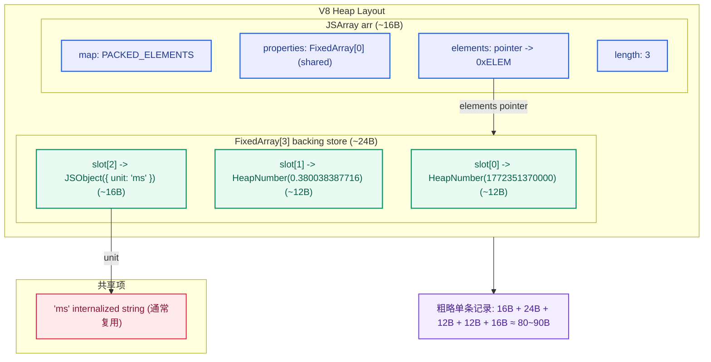
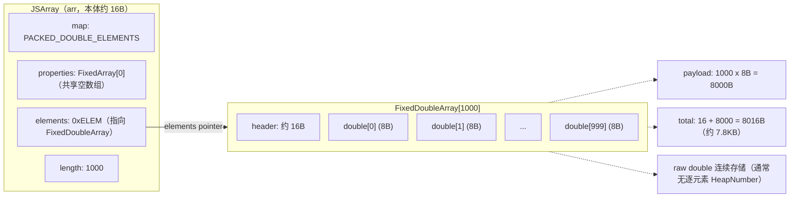

## 起因：内存占用问题

在字节跳动实习的时候，我曾经做过一次内存优化。当时应该是7月的下半旬。当时，一个兄弟产品遇到了一个白屏问题。根据客户反馈，当他们在页面中嵌入了十几个图表，并拉取了一个月时间范围的数据后，浏览器无响应。经过排查，我们确认问题出在内存占用过多，导致了浏览器崩溃。这个问题当时分派给了我去研究，看看有没有办法解决。

## 现有数据结构：高内存占用的根源

我所在团队是可观测团队，后端返回的数据大量采用 Grafana 的 DataFrame 格式。团队内部有统一的图表库，用于给可观测产品提供一致的图表体验：既要兼容 Grafana DataFrame，又要贴合火山引擎整体设计主题。


当时，我优化的是时序图组件。在可视化领域，充满了大对象或大数组，所以当时就自然而然的就想到了：可以从数据结构的方向入手。

原始场景可以抽象为：

- 一个图表绘制 **m 条折线**
- 每条折线包含 **n 个点**
- 每个点除了 `(x, y)` 之外，还携带 meta 信息（用于tooltip、标注等）

此前图表库会解析 DataFrame，并转换为 ECharts 的 `series` 结构，所以我们当时的数据形态大致如下，每个数据点用一个三元组表示：

```js
series: [
  {
    type: "line",
    // "lineStyle","areaStyle", "name", "connectNulls" ...
    data: [[x1, y1, meta1], [x2, y2, meta2], ...]
  },
  {
    type: "line",
    data: [[x1, y1, meta1], [x2, y2, meta2], ...]
  },
];
```

## 三元组的内存占用分析（含 V8 细节）

> 这一章节的阅读会包含到一些v8底层的东西。

推荐阅读：

- [深入V8 - js数组的内存是如何分配的](https://juejin.cn/post/7004038556750446623)
- [Elements kinds in V8](https://v8.dev/blog/elements-kinds)

示例数据点：

```json
[[1772351340000, 0.348785871965, { "unit": "ms" }],
 [1772351370000, 0.380038387716, { "unit": "ms" }], ...]
//索引: 0                1              2
//类型: HeapNumber   HeapNumber       Object
```

当前结构用“三维数组”存数据：每个点是 `[x, y, metaObj]`。其中 `metaObj` 是对象，内部字段数为 q（字符串/数值/布尔/枚举等）。

### 为什么混类型数组会更“贵”

> V8引擎中的数组（JSArray）分为慢数组和快数组，慢数组索引线性连续存储，慢数组使用HashTable存储。每个 JS 数组都关联着一个元素类型（element kind），这是 V8 引擎跟踪的元数据，用于优化数组操作。这些类型描述了数组中存储的元素类型。我们当前场景下，只涉及到了element kind。

V8对数字进行了分类，将数字分为了`Smi`（小整数） 和 `HeapNumber`。`Smi`更高效，节省内存(可以内联，仅4B)。而任何超出 31/32 位整数范围的数字或带有小数点的数字会存储为`HeapNumber`，而`HeapNumber`常规情况下，每个占据内存 12B。

在 V8 中，数组会根据元素类型采用不同的 elements kind 来优化：例如纯数字可用 `PACKED_DOUBLE_ELEMENTS`，连续存储 raw double；而混类型数组通常退化为 `PACKED_ELEMENTS`，底层是指针数组（tagged values），从而带来更多对象分配与 GC 压力。

当前时序图单点的数据里：

- `x` 是 13 位时间戳，超过 SMI 范围 → **HeapNumber**
- `y` 是浮点数 → **HeapNumber**
- `meta` 是对象 → **JSObject**

因此 `[x, y, meta]` 会使用 `PACKED_ELEMENTS`。

我们来使用`debug-v8`来实测和计算一下，这个3元组的底层是什么样的。

```bash
% ./v8/d8  --allow-natives-syntax
V8 version 14.7.126.1
d8> const arr = [1772351340000, 0.348785871965, { unit: "ms" }];
undefined
d8> %DebugPrint(arr);
DebugPrint: 0x15de0104b611: [JSArray]
 - map: 0x15de01028955 <Map[16](PACKED_ELEMENTS)> [FastProperties]
 - prototype: 0x15de01028231 <JSArray[0]>
 - elements: 0x15de0104b5cd <FixedArray[3]> [PACKED_ELEMENTS]
 - length: 3
 - properties: 0x15de000007bd <FixedArray[0]>
 - All own properties (excluding elements): {
    0x15de00000df1: [String] in ReadOnlySpace: #length: 0x15de00887699 <AccessorInfo name= 0x15de00000df1 <String[6]: #length>, data= 0x15de00000011 <undefined>> (const accessor descriptor, attrs: [W__])
 }
 - elements: 0x15de0104b5cd <FixedArray[3]> {
           0: 0x15de01039acd <HeapNumber 1772351340000.0>
           1: 0x15de01039ad9 <HeapNumber 0.348786>
           2: 0x15de0104b5e1 <Object map = 0x15de01039b8d>
 }
0x15de01028955: [Map] in OldSpace
 - map: 0x15de01020131 <MetaMap (0x15de01020181 <NativeContext[306]>)>
 - type: JS_ARRAY_TYPE
 - instance size: 16
```

### 1) 这三个元素分别是什么存储形态？

根据上面的 `%DebugPrint` 输出，可以确认三元组的底层形态为：

- `JSArray`（元素种类 `PACKED_ELEMENTS`）
- elements 指向 `FixedArray[3]`（3 个 tagged slots，也就是存放了3个引用）
- 其中前两个元素为 `HeapNumber`，最后一个元素`{unit:"ms"}`为 `JSObject`

### 2) 三元组在堆上的对象拆分

> 在2020 年后，V8 有了指针压缩，将堆限制在 4GB 地址空间内，并指针存为 32 位偏移量（相对于堆基址），这样指针从 8 字节 就从变成了4 字节。但是很多 ai 分析的时候，常常忘记这一点。

```plaintext
┌─────────────────────────────────────────────────────────────┐
│                    JSArray 对象头（16 字节）                  │
├─────────────────────────────────────────────────────────────┤
│  Map (4B)      │  指向隐藏类（JS_ARRAY_TYPE）                 │
├─────────────────────────────────────────────────────────────┤
│  Prototype (4B)│  压缩指针，指向 Array.prototype              │
├─────────────────────────────────────────────────────────────┤
│  Elements (4B) │  指向实际存储元素的**后备存储**                │
├─────────────────────────────────────────────────────────────┤
│  Length (4B)   │  数组长度（uint32），作为 Smi 内联存储          │
└─────────────────────────────────────────────────────────────┘
```

根据Debug信息我们可以分析：

1.  **JSArray 本体**：根据 `%DebugPrint(arr)`的测量结果， map 段里：`instance size: 16`。所以 **JSArray 对象本体 = 16 B**。

2.  **elements backing store**：数组数据在堆里实际存储的对象，`FixedArray[3]`是“指针数组”，大小 = header + 3 个 slot。slot 大小由于v8进行过指针压缩的优化，所以单个指针的内存占用是 **4B**，3 个 slot = 12B，此外还有内存对齐，header 可能会对齐到 8/16（不同版本略有差异），但总之这块**很小**，数量级就是二三十字节，这里我们估算为 **“\~24B”**。

3.  **两个 HeapNumber**：时间戳（13 位）超出 Smi 范围，浮点数也无法是 Smi，因此两者都会以 HeapNumber 形式存在。`%DebugPrint` 显示单个 HeapNumber `instance size: 12`。所以两个合计 **24B**。

4.  **meta 对象（如 `{ unit: "ms" }`）**\
    `%DebugPrint(arr[2])` 显示 `instance size: 16`，且 `inobject properties: 1`，`properties: FixedArray[0]`（共享空数组），说明 `unit` 是 **in-object 内联属性**，值是 `#ms` 字符串。所以这个对象实例本体就是：**JSObject = 16B**。

5.  **字符串 `"ms"`** ：`arr[2].unit` 是 `INTERNALIZED_ONE_BYTE_STRING_TYPE`。这类字符串通常会 **internalize（驻留）** ：同值在整个 isolate 内一般只有一份，可被多处复用。它的大小通常是：对象头 + 2 字节字符数据 + 对齐，属于**十几到几十字节量级**。但由于可复用，很多情况下对“每个点”的新增占用接近 0。

### 3) 汇总：单个点的新增内存



把可重复复用的部分（如 `"ms"`）先按“**可能不新增**”处理，则单个三元组的新增开销主要来自：

- JSArray：≈ 16B
- FixedArray\[3]：≈ 24B
- HeapNumber ×2：≈ 24B
- JSObject(meta)：≈ 16B

合计：**16 + 24 + 24 + 16 = 80B**（再加上少量对齐/元数据差异）

所以可以把单条记录的新增内存记为：

> **≈ 80\~90B / 点（数量级）**

这就是为什么当点数达到几十万、上百万时，内存会快速膨胀：

- 每个点不仅是两个数字，更包含多个堆对象（HeapNumber、JSObject、JSArray、FixedArray）
- 对象越多，GC 扫描与碎片成本也会随之上升
- 混类型数组无法享受 `FixedDoubleArray` 的紧凑存储与更轻的 GC 扫描（具体可见下文）

## 不同存储顺序的区别

另一个因素是：**数据排列方式会改变“子数组数量”** ，从而改变对象数量、指针数量、碎片程度和 GC 压力。

把问题抽象为在二维数组中存储 `x * y` 个基础数据，设 `x ≪ y`：

| 方式   | 描述         | 子数组 | 每个子数组长度 |
| ------ | ------------ | ------ | -------------- |
| 行优先 | 每行连续存储 | `x` 个 | `y`（很大）    |
| 列优先 | 每列连续存储 | `y` 个 | `x`（很小）    |

虽然元素总数相同，但“数组的数组”意味着：**子数组越多，JSArray 对象也越多（每个约 16B 起步，元数据等也变多。**

因此，在 `x ≪ y` 的前提下，把数据组织成“行优先（少数组、长数组）”往往更省内存、更利于性能。

证明：

关系图（场景：`JSArray(length=1000)`，`elements` 指向 `FixedDoubleArray[1000]`）



分析数组的内存占用组成：每个数组首先是一个 `JSArray` 对象，包含固定头部，由上一小节可以知道， `JSArray` 的对象头就是16B，数组的实际数据通过 `elements` 指针指向另一个堆对象。所以每多一个数组，就多一个16B的固定开销。所以子数组越多，**指针越多、对象越多、元数据越多、碎片越多、GC 越重**。

如果将数组进行一个转置，数据放置思路按行连续存储，数组的数量就能大大减少，能减少不少这种内存占用。

而elements 指针指向的 Elements 后备存储（Backing Store），根据类型的不同，对内存的利用率也不同，请看下一节。

## 纯数字数组的内存利用

我构造了一个长度 10000 的纯13位时间戳数组，`%DebugPrint` 显示其 elements kind 为 `PACKED_DOUBLE_ELEMENTS`，elements 指向 `FixedDoubleArray[10018]`：

```bash
d8> const array = [];
d8> new Array(10000).fill(1).forEach((v, i) => { array[i] = 1772351340000 + i;});
d8> %DebugPrint(array);
DebugPrint: 0x15de0104d411: [JSArray]
 - map: 0x15de010288cd <Map[16](PACKED_DOUBLE_ELEMENTS)> [FastProperties]
 - prototype: 0x15de01028231 <JSArray[0]>
 - elements: 0x15de010cd071 <FixedDoubleArray[10018]> [PACKED_DOUBLE_ELEMENTS]
 - length: 10000
 - properties: 0x15de000007bd <FixedArray[0]>
 - All own properties (excluding elements): {
    0x15de00000df1: [String] in ReadOnlySpace: #length: 0x15de00887699 <AccessorInfo name= 0x15de00000df1 <String[6]: #length>, data= 0x15de00000011 <undefined>> (const accessor descriptor, attrs: [W__])
 }
 - elements: 0x15de010cd071 <FixedDoubleArray[10018]> {
           0: 1.77235e+12 (0x4279ca85f3de0000)
           1: 1.77235e+12 (0x4279ca85f3de1000)
           2: 1.77235e+12 (0x4279ca85f3de2000)
...
        9999: 1.77235e+12 (0x4279ca85f64ef000)
 10000-10017: <the_hole>
 }
0x15de010288cd: [Map] in OldSpace
 - map: 0x15de01020131 <MetaMap (0x15de01020181 <NativeContext[306]>)>
 - type: JS_ARRAY_TYPE
 - instance size: 16
...
```

> 为什么长度是10018，而10000-10017是\<the_hole>？因为js内数组长度不是固定的，当v8预留的内存不够时，就需要扩容。V8 的[注释](https://chromium.googlesource.com/v8/v8/%2B/78ca705f473cda3af78a77a2cfe85eb9be2cfa4d/src/objects/js-array.h)是这么写的：fast 模式下 length <= elements.length()。而V8 的 NewElementsCapacity 计算规则（源码注释）是：
> `new_capacity = (old_capacity + 50%) + kMinAddedElementsCapacity`，其中 `kMinAddedElementsCapacity = 16`

可以看到，这与我们之前用三元组存数据时有一个关键差异在于：

- 三元组存数据是混类型数组 `PACKED_ELEMENTS`：存的是 **tagged 指针槽**（地址引用），`HeapNumber`数字会被装箱，产生额外对象头与 GC 成本
- 纯数字数组 `PACKED_DOUBLE_ELEMENTS`：存的是 **raw double**，连续内存，**每个元素 8B**，无逐元素 HeapNumber 分配，cache 友好、GC 更轻

所以简单来说，就同样需要在数组中存储单个HeapNumber。用之前的数据结构，**需要 `4B(tagged Size，有指针压缩) + 8B(HeapNumber Size) = 12B`** 。而`FixedDoubleArray`场景下，元素的数据直接内联到数组中，只占用 8B。在大数据场景下，这个优化的意义是毋庸置疑的。不仅是内存占用的减少，在同样的 L1/L2 缓存能装下更多的数字，减少 CPU 等待内存读取的时间。

> 之前我曾经尝试过用 `%DebugPrint(array[42])`这种方法来获取元素的`instance size`和地址，然后根据相邻元素算实际内存占用。获取的 `instance size = 12`，然后我自己算得的地址差也是 12，我就一度以为在 `PACKED_DOUBLE_ELEMENTS` 内单个 `HeapNumber` 也占12B内存。但是这种方法实际是错误的。这里获取的实际是 array\[i] 装箱出来的 `HeapNumber`。

---

### 题外话：SMI数组是什么样的

如果往数组里都放小整数，`array.elements`的实际对象是`FixedArray`,元素种类是`PACKED_SMI_ELEMENTS`，如下。

```bash
d8> const numArr = Array.from({ length: 10000 }, (v, i) => i);
d8> %DebugPrint(numArr);
DebugPrint: 0x15de010e0ad9: [JSArray]
 - map: 0x15de01028209 <Map[16](PACKED_SMI_ELEMENTS)> [FastProperties]
 - prototype: 0x15de01028231 <JSArray[0]>
 - elements: 0x15de010e0ae9 <FixedArray[10000]> [PACKED_SMI_ELEMENTS]
 - length: 10000
...
 - elements: 0x15de010e0ae9 <FixedArray[10000]> {
           0: 0
           1: 1
           2: 2
           3: 3
```

对于`FixedArray`，每个槽均4B空间，每个元素是一个 tagged 值，可能是：

- **Smi**（小整数，直接编码在值里，不指向堆）
- **HeapObject 指针**（比如 HeapNumber、String、JSObject）
- **特殊标记值**（比如 the_hole、undefined 等）

而V8底层是怎么知道tagged 值里面到底是存的值还是引用呢。V8 使用了 Pointer Tagging 技术，在堆中，指向对象的指针末尾总是标记为 1（表示这是一个 Strong Heap Object）。

所以，如果将相同类型的值都放到一个数组中，可以节省大量内存，还有利于提升运行速度。

## 优化方案：数据扁平化 + 转置，降低对象数量并命中更优 elements kind

### 1) 数据转置：减少子数组数量

我们采用“转置”思路，将原本按 `m * n * q`（或类似维度）的组织方式，调整为 **更利于减少数组数量** 的布局，例如把结构从 `m * n * q` 转为 `m * q * n`，以降低子数组数量及其固定开销。

### 2) 数据扁平化：拆解 metaObj，避免每点一个对象

核心优化是把 `meta` 从“每个点一个对象”改为“拆成基础类型并用索引/映射关联”：

- 原结构：`m * n * 3`（每点一个 `[x, y, metaObj]`，并且 metaObj 还是对象）
- 新结构：把 `meta` 拆成基础列，整体变成更接近 **列式存储** 的形态\
  例如：`m * (2 + q) * n`

这样做的收益：

- 大幅减少 `JSObject` 与小数组数量
- 让更多数据列保持“纯数字数组”形态，从而更容易命中 `PACKED_DOUBLE_ELEMENTS`
- GC 压力显著下降，连续内存更 cache 友好

### 3) 采用 Dataset：减少重复结构与提升数据复用

经过转置和扁平化后，数据结构变为 宽表形态（dimensions × n），天然适合 Dataset 的列式存储：

```js
// 优化前：每个 series 独立 data
option = {
  series: lines.map(line => ({ data: line.points }))
};

// 优化后：统一 dataset，series 通过 encode 映射
option = {
  dataset: {
    source: [
      ['time', 'line1', 'line2', 'line3', ...],  // 首行为维度名
      [t1, v1_1, v2_1, v3_1, ...],
      [t2, v1_2, v2_2, v3_2, ...],
      ...
    ]
  },
  series: lines.map((_, i) => ({
    type: 'line',
    encode: { x: 0, y: i + 1 }
  }))
};
```

相比 `series.data` 的嵌套结构，Dataset 的优势在于：

1.  **内存优化**：单一数组存储，减少嵌套对象和重复元数据
2.  **数据-视觉解耦**：原来数据写在`series.data`中，改成Dataset数据与 encode 映射分离
3.  **扩展性**：一份数据可映射到多种图表类型（折线、柱状、散点、热力图等），无需重复转换。未来新增图表类型时，数据层零改动，只需定义新的 `encode` 映射

## 优化效果：内存占用显著下降

经过优化后，内存占用的变化明显。以下是几个不同场景下内存占用的对比：


### 1) 场景一：小数据量（5条线段，每条线121个点，共605个点））

优化前：内存占用 60MB
优化后：内存占用 29MB
内存节省率：51.6%

### 2) 场景二：大数据量（5条线段，每条线181500个点，共90.8w个点）

优化前：内存占用 1491MB
优化后：内存占用 281MB
内存节省率：81.2%

### 3) 场景三：增加数据条数（39条线段，每条线6050个点，共84.1W个点）

优化前：内存占用 1538MB
优化后：内存占用 199MB
内存节省率：87%

可以看出，优化后内存占用大幅降低，尤其是在数据量大的情况下，节省的内存量尤为显著。

## 配套优化措施

在这次优化过程中，我还顺带进行了一些配套优化措施：

### 1) 事件回调优化

- **原方案**：React `useState` + `useLayoutEffect` 获取 ECharts 实例
- **优化后**：使用普通函数回调，通过 `this` 访问实例，避免额外状态管理
- **额外收益**：无事件绑定场景下短路处理，直接跳过监听

### 2) 循环性能优化

- 将 `forEach`/`map` 改为原生 `for` 循环，减少迭代器开销

### 3) 数据不可变性修复

- 发现倒序排序场景使用 `reverse()` 导致原始数据被意外修改
- 改为 `toReversed()`（或 `slice().reverse()`），避免副作用

## 6. 总结与展望

在大规模可视化场景中，**数据结构往往是最具杠杆的性能开关**。通过“扁平化 + 转置 + Dataset 化”，我们不仅解决了崩溃问题，还显著降低了内存占用，并提升了稳定性与响应速度。
