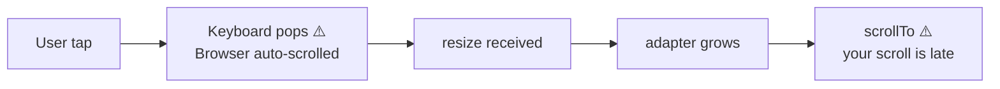
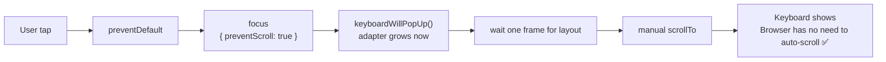
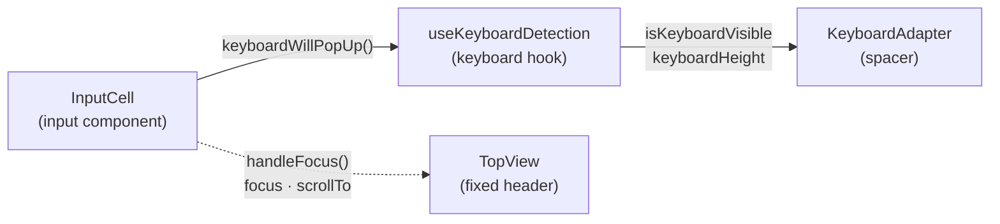

> Guys, this is ridiculous. Whole world support this, only Safari doesn't. Please fix it. You don't know how much unnecessary work it adds to people to get around this kind of thing.

The comment above comes from an issue thread in Safari. When building B2C products—especially mobile web—my friends and I all feel the developer experience is painful.

During a recent B2C internship I collected some lessons. Many problems had no good answers online, so I’m writing a few posts to give back to the community.

---

## What You’ll See


I built a tiny [demo](http://kairi.cc/zh/gallery/ios-input): a sticky element at the top, and an input further down the page.

On iOS, when you tap the input, the soft keyboard rises, the input moves up, and the sticky element stops sticking.

**Tap an input near the bottom, the keyboard pops, the page auto-scrolls (often via visual viewport offset), and anything with “special positioning” starts drifting, misaligning, or seems broken.**

Worse: you may already have the classic “listen for keyboard + raise adapter + scroll into place” fix, but it explodes when (1) the input is near the bottom or (2) the page was originally non-scrollable.

---

## Background: Layout Viewport vs. Visual Viewport

Before keyboard talk, we must separate two viewports—this is key to everything that follows.

**Layout Viewport** is the coordinate system CSS uses; `position: fixed` and `position: sticky` are anchored to it. Its size is set at browser init and does not change when the keyboard shows.

**Visual Viewport** is the “window” the user actually sees. When the keyboard appears, its height shrinks and it can shift with an `offsetTop`—meaning the visual viewport moves inside the layout viewport.


On desktop these viewports almost always overlap. On iOS, **the visual viewport shrinks and shifts when the keyboard appears, while the layout viewport stays the same**. That’s why `position: fixed` elements seem to “float”—they haven’t moved relative to the layout viewport, but the user’s viewing window has.

Android behaves differently: most Android browsers shrink the layout viewport itself (`window.resize` fires), so fixed elements get relaid out and usually stay put.

---

## Why Does iOS Auto-Scroll When an Input Focuses?

Because of two design choices:

1. **Phones are small; avoid absolute positioning.** The Safari team views `position: fixed` on mobile as an anti-pattern, so they won’t add special handling to keep fixed elements stable.
2. **To ensure usability, the keyboard must keep the input visible**, so WebKit auto-scrolls the visual viewport. This is kernel-level behavior—JavaScript can rarely stop it.

### `focus()` Scrolls Into View by Default

Browsers default to scrolling a focused element into view. The `preventScroll` option on `HTMLElement.focus()` controls this—default `preventScroll: false` means it will scroll; set it to `true` to say “don’t scroll.” ([MDN][1])

Reality on iOS: `focus({ preventScroll: true })` was unsupported before iOS 15.5; it’s supported from 15.5, but with version/implementation quirks. ([Can I Use][2])

### iOS Keyboard Changes Both Height and Offset

When the iOS keyboard appears, it’s more like **the visual viewport shrinks and gains an offsetTop** than “the layout resizes honestly.” Once the visual viewport shifts, `position: fixed`, sticky items, and overlay systems inside transformed containers can misalign, and sometimes the offset lingers after the keyboard hides (e.g., `visualViewport.offsetTop` not returning to zero). ([WebKit Bugzilla][3])

This explains why the same code works on Android but not on iOS—the platforms treat keyboard show/hide fundamentally differently.

### iOS Requires Focus in a User Gesture

Another often-missed hard rule:

> **To actually raise the keyboard on iOS, programmatic focus must happen synchronously inside the user gesture (tap/click) call stack.** Put it in `setTimeout`, a Promise, or an async callback and the keyboard may not appear, or may behave inconsistently.

This isn’t folklore; the community is full of examples:

- `setTimeout(... focus())` in iOS Safari fails to show the keyboard ([Stack Overflow][4])
- In WKWebView since iOS 11.3, `focus()` became unreliable unless triggered by a real tap ([Ionic Forum][5])
- WebKit bug threads explicitly note JS focus outside touch events may not raise the keyboard ([WebKit Bugzilla][6])

**This rule shapes the whole solution:** you can’t rely on “when the keyboard is about to appear I’ll fix it,” because fixes run in async timing; you must lay the track during the user’s touch/click callback.

---

## Traditional Fixes and Their Limits

### What We Used to Do

Our prior approach: insert an adapter spacer on form pages, listen for keyboard show, increase spacer height, then scroll the page to keep the input visible.

```
Keyboard shows → resize listener fires → adapter grows → scrollTo target
```

Simple idea: if the visible area shrinks, pad the bottom with a spacer the height of the keyboard so the page can scroll further, then `scrollTo` the input.

### Where It Fails

Two scenarios always break:

1. **Input near the bottom:** before you can scroll, the keyboard appears and the browser auto-scrolls the visual viewport. Your later `scrollTo` stacks with the browser’s scroll—double scroll jitter.
2. **Page not scrollable originally:** before the keyboard, `scrollHeight == clientHeight`, so `scrollTo` punches air. Only after the keyboard shows does scrolling become possible, but by then the browser has already auto-scrolled.

Fundamentally a timing issue:



By the time you have reliable data, the browser may have scrolled already.

### Layout Gotchas

Another puzzle: all inputs used the same component, yet some pages worked and others didn’t.

Digging the code: we use Taro, calling `Taro.pageScrollTo` which modifies the current route element’s `scrollTop`. Pages that failed had the scrollable container nested, not outermost—so we were scrolling the wrong element.

Nested scroll containers are common on mobile (flex compression, limited space). If your scrolling API touches the wrong container, nothing happens. After restructuring, this was fixed.

---

## Exploration

### Attempt 1: Beat the Clock

Based on event order, I tried listening to `touchstart` in capture to run before input focus.

In theory: `touchstart` (capture) → `touchstart` (bubble) → `touchend` → `focus`, so capture-phase `touchstart` should run earlier than `focus`.

But **users trigger scrolling on mere touch—they may just want to scroll, not tap the input.** Not acceptable. Switching to `touchend` makes it fire nearly with `focus`, losing the timing edge.

So it works but behaves incorrectly.

### Attempt 2: Scroll First, Then Focus

Prevent default focus, scroll first, then manually focus.

But `Taro.pageScrollTo` is async—reading the source shows it animates `scrollTop` across multiple frames (`requestAnimationFrame`/`setTimeout`). The keyboard may appear mid-animation.

If we focus in the `onSuccess` callback, we violate the iOS rule: **focus must be in the synchronous user gesture chain**; the callback is in another tick. Some suggest changing WKWebView’s `keyboardDisplayRequiresUserAction`, but on some devices it still fails—worked on mine, not on older test phones.

Native `scrollTo` is similar—non-blocking animation. Using `setTimeout` enters another event loop. Only setting `scrollTop` synchronously works, but it jumps instantly—jarring.

### Turning Point: `focus({ preventScroll: true })`

This blocked me for a while. StackOverflow had many “trick” ideas—focus a hidden input first, then transfer focus, etc.

By chance I saw a note that [focus-lock](https://github.com/theKashey/focus-lock) calls:

```js
element.focus(focusOptions);
```

`focus` takes options?!

I’d thought `focus()` was parameterless. MDN confirmed `FocusOptions` with `preventScroll` defaulting to `false`. Set to `true` to **stop the browser’s auto-scroll on focus**.

Chrome has supported this since 2018, but iOS Safari/WebView only since 2022 (iOS 15.5). That’s why old tutorials/answers omit it—it truly didn’t work on iOS for years.

This saved the day. Once `preventScroll` is in place, focus timing no longer matters—just prevent auto-scroll and fully control scrolling yourself. The “scroll first or focus first” timing headache disappears.

---

## Core Approach: Pre-announce the Keyboard and Create Scroll Space Early

With `preventScroll`, most cases worked. But some pages still failed: non-scrollable pages, or inputs near the bottom needing extra distance—both rely on the adapter growing after detecting the keyboard, creating delay or incomplete scroll.

To fix it, I **“pre-announce” the keyboard at focus time**, making the adapter grow immediately and creating scroll space up front.

### Plan



Contrast with the old timeline:

```
Old:
[tap] → [focus (triggers auto-scroll)] → [keyboard shows] → [resize] → [adapter grows] → [scrollTo]
                ↑                    ↑                               ↑
        Browser already scrolled   Too late                     Your scroll even later

New:
[tap] → [preventDefault] → [focus(preventScroll)] → [announce keyboard] → [adapter grows] → [scrollTo] → [keyboard shows]
                              ↑                        ↑            ↑              ↑
                        No auto-scroll           Grows immediately  Space ready   You claim the spot first
```

**Non-scrollable pages:** adapter rises before the keyboard, turning `scrollHeight == clientHeight` into `scrollHeight > clientHeight` so scrolling works.

**Bottom inputs:** move the input to its future visible spot before the visual viewport changes; Safari has less reason to auto-scroll.

---

## Implementation Details

### Architecture

Four modules collaborate:



Data flows one way: `InputCell` emits a “keyboard will pop” signal on tap; `useKeyboardDetection` receives it and updates state; `KeyboardAdapter` reads state to change height.

### Rewriting the Keyboard Hook

To broadcast the “about to pop” signal, detection must be a singleton for cross-page/component events.

Old hook used `useState` + `useEffect` per call—N calls mean N states and N listeners, and no way to push events in:

```
Component A → state_A + listener_A
Component B → state_B + listener_B
Component C → state_C + listener_C
// isolated states/listeners, cannot receive external “will pop” signals
```

My refactor:

1. **State in Context:** wrap the app with a Provider so everyone shares one keyboard state.
2. **Use `useSyncExternalStore` instead of `useEffect`:** React 18 hook for “subscribe to external store.” It takes `subscribe` and `getSnapshot`, cleanly separating subscription from reads. It avoids extra renders and stays consistent in concurrent mode.
3. **Expose updates via closure:** `subscribe` receives a `callback`; storing it in module scope lets `keyboardWillPopUp()` trigger updates.

Core “pre-announce” mechanism:

```ts
// Module scope
let willPopup = { signal: false, timestamp: 0 };
let keyboardDetectCallback = () => {};

// Called externally to announce the keyboard
export function keyboardWillPopUp() {
  willPopup.signal = true;
  willPopup.timestamp = Date.now();
  keyboardDetectCallback(); // forces useSyncExternalStore to re-run getSnapshot
}

// Store the callback during subscribe
const subscribe = (callback) => {
  keyboardDetectCallback = callback; // ← lets external calls trigger updates
  // ... add resize / visualViewport listeners
  return () => {
    /* cleanup */
  };
};
```

Logic in `getSnapshot()`:

- If `willPopup.signal` is `true`, set `isKeyboardVisible` to `true` even before resize/visualViewport changes arrive.
- Reuse the last known keyboard height; if none, use a 340px estimate (iPhone keyboards are usually 300–360px); later resize events refine it.
- Adapter can thus grow immediately and create space.

Debounce detail: `willPopup.timestamp` records when the signal fired. `getSnapshot` ignores updates within 30ms if the keyboard is already visible—prevents back-to-back signal and resize from causing state flicker.

### Multi-Platform Detection

Different platforms need different signals:

| Platform    | Detection               | Reason                                                                     |
| ----------- | ----------------------- | -------------------------------------------------------------------------- |
| **iOS**     | `visualViewport.resize` | iOS keyboard doesn’t change `window.innerHeight`, only the visual viewport |
| **Android** | `window.resize`         | Android keyboard resizes the layout viewport, `window.innerHeight` changes |
| **Desktop** | `focusin` / `focusout`  | No soft keyboard; rely on focus state                                      |

Keyboard height calculation also differs:

- iOS / Android: `maxViewportHeight - currentViewportHeight`
- Desktop: fixed 340 (no keyboard; used as a fallback)

`deviceInfo.trusted` marks stability: when two consecutive height calculations are equal, treat the value as stable and stop updating.

### Focus Handler

```ts
function handleFocus(
  inputElement: HTMLInputElement | undefined,
  inputCellElement: HTMLDivElement | null,
  scrollOffsetCalFuc: (offsetTop: number) => number,
  event?: React.TouchEvent<HTMLElement>,
) {
  const offsetTop = inputCellElement?.offsetTop || 0;
  const toScrollTop = scrollOffsetCalFuc(offsetTop);

  // 1) Block the browser’s default focus scrolling
  event?.preventDefault();

  // 2) Focus immediately within the gesture chain (iOS requirement)
  //    preventScroll: true stops auto-scroll on focus
  inputElement?.focus({ preventScroll: true });

  if (toScrollTop) {
    // 3) Pre-announce the keyboard so the adapter grows now
    keyboardWillPopUp();

    // 4) Wait 100ms, then scroll
    //    Gives React time to process state + layout after adapter growth
    setTimeout(() => {
      Taro.pageScrollTo({
        scrollTop: toScrollTop,
        duration: 225, // smooth animation
      });
    }, 100);

    // 5) Fallback: reset documentElement scrollTop after 350ms
    //    For devices lacking preventScroll support (pre–iOS 15.5)
    //    100ms wait + 225ms animation ≈ 325ms; 350ms ensures completion
    setTimeout(scrollHtmlToTop, 350);
  }
}
```

Key timing: **focus must be synchronous in the gesture callback**; `setTimeout` is only for delaying scroll. If focus moved into `setTimeout`, iOS might not show the keyboard.

Scroll offset calculation:

```ts
const defaultScrollOffsetCalFuc = (offsetTop: number) => {
  const { viewportHeight, keyboardHeight } = getKeyboardInfo();
  // Target: place the input 150px above the keyboard
  // viewportHeight - keyboardHeight = visible height after keyboard
  // minus a 150px cushion as the input’s target Y
  const target = Math.max(viewportHeight - keyboardHeight - 150, 0);
  return Math.max(offsetTop - target, 0);
};
```

The 150px cushion is empirical—keeps the input slightly above the keyboard with surrounding context visible.

---

## Edge Cases and Fixes

Mobile work is mostly edge cases after the core logic ships.

### 1) Misfires: User Wants to Scroll, Not Input

If the finger lands on the input while scrolling, the keyboard shouldn’t appear.

**Fix:** Track `touchStart` + `touchEnd`; measure movement. If movement in X or Y exceeds 10px, treat it as scrolling and skip focus.

```ts
onTouchStart: (e) => {
  const touch = e.touches?.[0];
  touchStartXRef.current = touch?.clientX || 0;
  touchStartYRef.current = touch?.clientY || 0;
},
onTouchEnd: (e) => {
  const touch = e.changedTouches?.[0];
  const deltaX = (touch?.clientX || 0) - touchStartXRef.current;
  const deltaY = (touch?.clientY || 0) - touchStartYRef.current;
  if (Math.abs(deltaX) > 10 || Math.abs(deltaY) > 10) {
    return; // considered a scroll; skip focus
  }
  handleFocus(e.currentTarget, ...);
}
```

10px is a pragmatic threshold: smaller (e.g., 3px) treats slight tremors as scroll; larger (e.g., 20px) triggers focus even during obvious scrolling.

### 2) Don’t Hijack Touch When Already Focused

Keeping custom handlers while focused causes:

- **Caret drag disabled:** `preventDefault` on touch stops cursor dragging inside text.
- **Repeated focus flow:** after the keyboard is up, touching the input during scrolling re-runs the whole focus logic.

**Fix:** when focused or disabled, don’t bind the custom touch handler—let the browser behave normally.

```ts
// {} isn’t stable, but component rerenders when isFocused changes
const onTouchHandler = disabled || isFocused ? {} : onTouchHandlerBase;
```

### 3) Jank When Keyboard Shows/Hides

If the adapter height jumps instantly, the page “flashes”—adapter snaps from 0 to 300+px and content jumps.

**Fix:** add CSS transitions, but with different durations for show vs hide:

```scss
// Show: extremely short (25ms) so space appears almost instantly for scrollTo
.keyboard-adapter-content[data-keyboard-visible="true"] {
  transition: height 25ms ease-out;
}

// Hide: slightly longer (200ms) for a gentle return
.keyboard-adapter-content[data-keyboard-visible="false"] {
  transition: height 0.2s ease-out;
}
```

25ms is nearly instant but avoids render flicker; 200ms matches iOS keyboard hide animation.

Using a data attribute instead of a class keeps selectors simple and debuggable.

### 4) Old Devices Without `preventScroll`

Pre–iOS 15.5 lacks `focus({ preventScroll: true })`. Small share, so we only add a fallback: after the keyboard is up (~350ms), check if `document.documentElement.scrollTop` changed; if so, scroll back smoothly.

```ts
const scrollHtmlToTop = () => {
  // only when actually scrolled; avoid needless scrollTo
  document.documentElement.scrollTop &&
    document.documentElement.scrollTo({ top: 0, behavior: "smooth" });
};
```

We check `<html>` because on devices without `preventScroll`, the browser’s auto-scroll affects `documentElement`, while our business scrolling uses the page container—independent layers.

### 5) Touchmove on Fixed Elements

Sticky/fixed headers can be dragged to shift the visual viewport while the keyboard is up, because iOS allows panning the visual viewport after zoom-like changes.

**Fix:** prevent `touchmove` on those elements—they shouldn’t scroll.

```ts
function handleTouchMove(e: TouchEvent) {
  e.preventDefault();
  e.stopPropagation();
}

// In useEffect (AbortController for cleanup)
topViewRef.current?.addEventListener("touchmove", handleTouchMove, {
  signal: controller.signal,
});
```

---

## Effect and Full Code

Here are the three involved modules.

### useKeyboardDetection.ts — Keyboard Hook

```ts
import { getDeviceType } from '@/utils/device';
import noop from 'lodash/noop';
import debounce from 'lodash/debounce';
import isEqual from 'lodash/isEqual';
import {
  useEffect,
  useSyncExternalStore,
  createContext,
  useContext,
} from 'react';

export interface KeyboardDetectionResult {
  isKeyboardVisible: boolean;
  viewportHeight: number;
  maxViewportHeight: number;
  keyboardHeight: number;
}

enum METHOD {
  VisualViewport = 1, // iOS: listen to visualViewport.resize
  Resize = 2,         // Android: listen to window.resize
  FocusEvent = 3,     // Desktop/old browsers: focusin/focusout
}

let currentMethod: METHOD = METHOD.FocusEvent;
let willPopup = { signal: false, timestamp: 0 };
const deviceType = getDeviceType();

let keyboardStatus: KeyboardDetectionResult = {
  isKeyboardVisible: false,
  keyboardHeight: 0,
  viewportHeight: 0,
  maxViewportHeight: 0,
};

let keyboardDetectCallback: () => void = noop;

// Pre-announce keyboard
export const keyboardWillPopUp = function () {
  willPopup.signal = true;
  willPopup.timestamp = Date.now();
  keyboardDetectCallback();
};

function init() {
  if (deviceType === 'ios' && window.visualViewport) {
    currentMethod = METHOD.VisualViewport;
  } else if (deviceType === 'android' && navigator.maxTouchPoints > 1) {
    currentMethod = METHOD.Resize;
  } else {
    currentMethod = METHOD.FocusEvent;
  }
}

const subscribe: Parameters<typeof useSyncExternalStore>[0] = (callback) => {
  const abort = new AbortController();
  const options: AddEventListenerOptions = {
    passive: true,
    capture: true,
    signal: abort.signal,
  };
  keyboardDetectCallback = callback;
  const debounceCallback = debounce(callback, 300);

  if (currentMethod === METHOD.VisualViewport) {
    window.visualViewport!.addEventListener('resize', debounceCallback, options);
  } else if (currentMethod === METHOD.Resize) {
    window.addEventListener('resize', debounceCallback, options);
  } else {
    document.body.addEventListener('focusin', debounceCallback, options);
    document.body.addEventListener('focusout', debounceCallback, options);
  }
  return () => abort.abort();
};

let deviceInfo = {
  maxViewportHeight: 0,
  keyboardHeight: 0,
  trusted: false, // mark stable after two identical measurements
};

export const getKeyboardInfo = () => ({
  keyboardHeight: deviceInfo.trusted ? deviceInfo.keyboardHeight : 340,
  viewportHeight: deviceInfo.maxViewportHeight,
});

function deviceInfoInit(currentViewportHeight: number) {
  if (deviceInfo.trusted) return;
  const maxViewportHeight = Math.max(currentViewportHeight, deviceInfo.maxViewportHeight);
  const keyboardHeight =
    currentMethod === METHOD.FocusEvent
      ? 340
      : Math.max(deviceInfo.keyboardHeight, maxViewportHeight - currentViewportHeight);
  const newDeviceInfo = { maxViewportHeight, keyboardHeight, trusted: false };
  deviceInfo = newDeviceInfo;
  isEqual(deviceInfo, newDeviceInfo) && keyboardHeight !== 0
    ? (deviceInfo.trusted = true)
    : (deviceInfo = newDeviceInfo);
}

const getSnapshot = (): KeyboardDetectionResult => {
  const viewportHeight =
    currentMethod === METHOD.VisualViewport
      ? window.visualViewport!.height
      : window.innerHeight;
  deviceInfoInit(viewportHeight);

  let realKeyboardVisibility = false;
  if (currentMethod === METHOD.FocusEvent) {
    const activeEl = document.activeElement;
    const isInput =
      activeEl &&
      (activeEl.tagName === 'INPUT' ||
        activeEl.tagName === 'TEXTAREA' ||
        (activeEl as HTMLElement).isContentEditable);
    realKeyboardVisibility = !!isInput;
  } else {
    // treat viewport height drop >150px as keyboard visible
    realKeyboardVisibility = deviceInfo.maxViewportHeight - viewportHeight > 150;
  }

  const shouldUpdate =
    realKeyboardVisibility !== keyboardStatus.isKeyboardVisible ||
    viewportHeight !== keyboardStatus.viewportHeight ||
    willPopup.signal;
  // ignore snapshots within 30ms of a pre-announce when keyboard already visible
  const shouldIgnore =
    Math.abs(Date.now() - willPopup.timestamp) < 30 &&
    keyboardStatus.isKeyboardVisible;

  if (shouldUpdate && !shouldIgnore) {
    keyboardStatus = {
      isKeyboardVisible: realKeyboardVisibility || willPopup.signal,
      viewportHeight,
      keyboardHeight: deviceInfo.keyboardHeight,
      maxViewportHeight: deviceInfo.maxViewportHeight,
    };
    willPopup.signal = false;
  }
  return keyboardStatus;
};

const KeyboardDetectionContext =
  createContext<KeyboardDetectionResult>(keyboardStatus);

export function KeyboardDetectionProvider({
  children,
}: {
  children: React.ReactNode;
}) {
  useEffect(init, []);
  const value = useSyncExternalStore<KeyboardDetectionResult>(
    subscribe,
    getSnapshot
  );
  return (
    <KeyboardDetectionContext.Provider value={value}>
      {children}
    </KeyboardDetectionContext.Provider>
  );
}

export function useKeyboardStatus(): KeyboardDetectionResult {
  return useContext(KeyboardDetectionContext);
}
```

### KeyboardAdapter — Spacer Component

```tsx
import { useKeyboardStatus } from "@/hooks/useKeyboardDetection";
import { View } from "@tarojs/components";
import "./index.scss";

export default function KeyboardAdapter({
  height = 0,
  extraHeight = 0,
}: {
  height?: number;
  extraHeight?: number;
}) {
  const { isKeyboardVisible, keyboardHeight } = useKeyboardStatus();
  return (
    <View className="keyboard-adapter">
      <View
        className="keyboard-adapter-content"
        data-keyboard-visible={isKeyboardVisible}
        style={
          isKeyboardVisible
            ? { height: Math.max(0, keyboardHeight ?? 300 - 167 + extraHeight) }
            : { height }
        }
      />
    </View>
  );
}
```

```scss
.keyboard-adapter {
  &-content {
    height: 500px;
    will-change: height;
  }
}
.keyboard-adapter-content[data-keyboard-visible="true"] {
  transition: height 25ms ease-out;
}
.keyboard-adapter-content[data-keyboard-visible="false"] {
  transition: height 0.2s ease-out;
}
```

### InputCell — Input Component (core logic)

Business UI (icons, textarea variant, clear button, etc.) omitted—only scroll-control logic is shown.

```tsx
import { Input } from "@nutui/nutui-react";
import { View } from "@tarojs/components";
import {
  useState,
  useCallback,
  useMemo,
  useRef,
  TouchEventHandler,
} from "react";
import Taro from "@tarojs/taro";
import {
  getKeyboardInfo,
  keyboardWillPopUp,
} from "@/hooks/useKeyboardDetection";

const preventScrollOption: FocusOptions = { preventScroll: true };

// 1) Compute target scroll: place input 150px above keyboard
const defaultScrollOffsetCalFuc = (offsetTop: number) => {
  const { viewportHeight, keyboardHeight } = getKeyboardInfo();
  const target = Math.max(viewportHeight - keyboardHeight - 150, 0);
  return Math.max(offsetTop - target, 0);
};

// 2) Legacy fallback: focus may scroll html; reset to top
const scrollHtmlToTop = () => {
  document.documentElement.scrollTop &&
    document.documentElement.scrollTo({ top: 0, behavior: "smooth" });
};

// 3) Core focus flow
function handleFocus(
  inputElement: HTMLInputElement | undefined,
  inputCellElement: HTMLDivElement | null,
  scrollOffsetCalFuc: (offsetTop: number) => number,
  event?: React.TouchEvent<HTMLElement>,
) {
  const offsetTop = inputCellElement?.offsetTop || 0;
  const toScrollTop = scrollOffsetCalFuc(offsetTop);
  event?.preventDefault(); // block default scrolling
  inputElement?.focus(preventScrollOption); // focus without auto-scroll
  if (toScrollTop) {
    keyboardWillPopUp(); // tell TopView to make room
    setTimeout(() => {
      Taro.pageScrollTo({ scrollTop: toScrollTop, duration: 225 }); // our scroll
    }, 100);
    setTimeout(scrollHtmlToTop, 350); // fix html.scrollTop if needed
  }
}

export default function InputCell({
  value,
  onChange,
  label,
  disabled = false,
}) {
  const [isFocused, setIsFocused] = useState(false);
  const inputRef = useRef(null);
  const inputCellRef = useRef<HTMLDivElement>(null);

  // 4) Custom touch handling: distinguish tap vs scroll
  const touchStartXRef = useRef(0);
  const touchStartYRef = useRef(0);

  const onTouchHandlerBase = useMemo<{
    onTouchStart: TouchEventHandler<HTMLElement>;
    onTouchEnd: TouchEventHandler<HTMLElement>;
  }>(
    () => ({
      onTouchStart: (e) => {
        const touch = e.touches[0];
        touchStartXRef.current = touch.clientX;
        touchStartYRef.current = touch.clientY;
      },
      onTouchEnd: (e) => {
        const touch = e.changedTouches[0];
        const deltaX = touch.clientX - touchStartXRef.current;
        const deltaY = touch.clientY - touchStartYRef.current;
        // Movement >10px means scroll intent—skip focus
        if (Math.abs(deltaX) > 10 || Math.abs(deltaY) > 10) return;
        handleFocus(
          e.currentTarget,
          inputCellRef.current,
          defaultScrollOffsetCalFuc,
          e,
        );
      },
    }),
    [],
  );

  // 5) When focused, fall back to browser defaults to avoid repeat logic
  const touchHandler = disabled || isFocused ? {} : onTouchHandlerBase;

  return (
    <View ref={inputCellRef}>
      <Input
        ref={inputRef}
        value={value || ""}
        onChange={onChange}
        onFocus={() => setIsFocused(true)}
        onBlur={() => setIsFocused(false)}
        disabled={disabled}
        {...touchHandler}
      />
    </View>
  );
}
```

---

## Compatibility Notes

1. **`preventScroll`:** iOS 15.5 added support, but WebKit bugs exist where it “supports” yet fails. Keeping the old-device fallback (resetting `documentElement.scrollTop` after focus) is sound engineering. ([Can I Use][2])
2. **Residual visualViewport offset:** in rare cases, `visualViewport.offsetTop` stays non-zero after hide, leaving sticky/fixed elements offset; correct it during keyboard hide or force reflow. ([WebKit Bugzilla][3])
3. **Keyboard height estimates:** before real resize data arrives, use a 300–360px estimate; refine after data. iPhone keyboard height varies by model, language, and prediction bar, but most fall in this range.

---

## Takeaways

| before                                                                            | after  |
| ------------------------------------------------------------------------------ | - |
|  |   |

The hardest part of iOS keyboard issues isn’t “calculating keyboardHeight,” it’s that:

- **By the time you have reliable data, the browser may have already scrolled.**
- **The moment you need to focus, iOS demands the synchronous user-gesture chain.**

This approach moves the critical actions earlier: **treat “keyboard visible” as a state you can _predict_, not just _detect_.** By doing `preventDefault → focus({ preventScroll: true }) → pre-announce keyboard → manual scroll` all within the gesture, the experience moves from “occasional jitter/misalignment” to “stable and controllable.”

It’s not a hack; it’s timing engineering.

[1]: https://developer.mozilla.org/en-US/docs/Web/API/HTMLElement/focus "HTMLElement: focus() method - MDN"
[2]: https://caniuse.com/mdn-api_htmlelement_focus_options_preventscroll_parameter "HTMLElement API: focus: options.preventScroll parameter"
[3]: https://bugs.webkit.org/show_bug.cgi?id=297779 "WebKit Bug 297779"
[4]: https://stackoverflow.com/questions/77918361/keyboard-does-not-appear-on-ios-when-use-settimeout-in-html "Keyboard does not appear on iOS when use setTimeout"
[5]: https://forum.ionicframework.com/t/ios-11-3-wkwebview-input-focus-not-working/126601 "iOS 11.3 WKWebView: input focus not working"
[6]: https://bugs.webkit.org/show_bug.cgi?id=195884 "WebKit Bug 195884: Autofocus on text input does not show keyboard"
