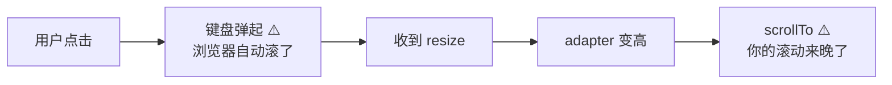
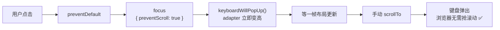
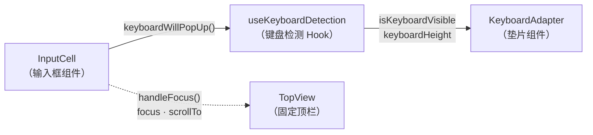

上图中的评论来自 Safari 的一个 Issue 评论区。做 C 端、特别是手机 Web 开发时，我和认识的朋友们普遍觉得开发体验非常难受。

最近做了一段 C 端实习，积累了一些经验，很多问题在网上都搜不到好用的解决方案。于是想写几篇文章产出一下，回馈社区。

---

## 问题现象

我做了一个简单的 demo：顶部有一个 sticky 定位的置顶元素，页面偏下的位置有一个输入框。

当在 iOS 里点击这一输入框时，软键盘弹起，输入框上移，而 sticky 定位的元素失效了。

**你点了一个靠近底部的 input，键盘一弹，页面自己滚了（有时是 visual viewport 的 offset 在变），然后"特殊定位"的元素就开始漂移、错位、甚至看起来像失效。**

更糟糕的是：你明明已经做了"键盘弹起监听 + adapter 顶高 + 滚动到合适位置"的老方案，但它在输入框靠近底部、或者页面本来不可滚动这两个场景下必炸。

---

## 背景知识：Layout Viewport 与 Visual Viewport

在讨论 iOS 键盘问题之前，需要先理解两个视口的区别，因为这是理解后续所有问题的关键。

**Layout Viewport**（布局视口）是 CSS 布局的参考系，`position: fixed` 和 `position: sticky` 都是相对于它定位的。它的大小由浏览器初始化时确定，不会因为键盘弹起而改变。

**Visual Viewport**（视觉视口）是用户实际看到的那个"窗口"。当键盘弹起时，visual viewport 的高度会缩小，同时可能产生一个 `offsetTop`——也就是说，visual viewport 在 layout viewport 内部发生了偏移。

```
┌─────────────────────────┐
│     Layout Viewport     │
│                         │
│  ┌───────────────────┐  │ ← Visual Viewport（用户看到的）
│  │                   │  │
│  │   页面内容         │  │
│  │                   │  │
│  └───────────────────┘  │ ← Visual Viewport 底部
│                         │ ← offsetTop: visual viewport 相对 layout viewport 的偏移
│  ┌───────────────────┐  │
│  │   软键盘           │  │
│  └───────────────────┘  │
└─────────────────────────┘
```

在桌面浏览器上，这两个视口几乎总是重合的。但在 iOS 上，**键盘弹起时 visual viewport 会缩小并偏移，而 layout viewport 保持不变**。这就是为什么 `position: fixed` 的元素看起来"飘了"——它相对于 layout viewport 没有移动，但用户通过 visual viewport 看到的位置变了。

Android 的行为有所不同：大部分 Android 浏览器在键盘弹起时会直接缩小 layout viewport（即触发 `window.resize`），所以 `fixed` 定位的元素会跟着重新布局，通常不会出现 iOS 那样的错位问题。

---

## 为什么 iOS 会在 input 聚焦时自动滚动？

背后原因是 iOS 的两个设计理念：

1. **手机屏幕本就小，为了展示更多内容，应该少用绝对定位的元素。** Safari 团队认为 `position: fixed` 在移动端是一种反模式，所以不会为了维持 fixed 元素的位置而做额外处理。
2. **为了保证用户体验，键盘弹起时需要让用户看到输入框**，会自动滚动 visual viewport。这个滚动是 WebKit 内核层面的行为，JavaScript 层面几乎无法阻止。

### `focus()` 默认会把元素滚进视野

浏览器的默认策略是：聚焦某个元素时，会尝试把它滚到可见区域。`HTMLElement.focus()` 的 `preventScroll` 参数就是为了控制这个行为——默认 `preventScroll: false`，所以会滚；设为 `true` 才表示"不准滚"。（[MDN][1]）

但 iOS 的现实是：`focus({ preventScroll: true })` 在 iOS 15.5 之前不支持；15.5 起支持，但还存在版本/实现差异。（[Can I Use][2]）

### iOS 键盘不仅改变"高度"，还会改变视觉视口的偏移

iOS 上的键盘弹起，很多时候更像是 **visual viewport 变小并产生 offsetTop**，而不是直觉中的"页面 layout 重新计算并老老实实 resize"。一旦视觉视口发生偏移，`position: fixed`、sticky 定位、transform 容器里的弹层定位系统就可能出现错位，甚至在键盘收起后还残留偏移（典型是 `visualViewport.offsetTop` 不归零）。（[WebKit Bugzilla][3]）

这也解释了为什么同一套代码在 Android 上表现正常，在 iOS 上就各种错位——两个平台处理键盘弹起的底层机制完全不同。

### iOS 的 focus 必须在用户手势里触发

还有一条经常被忽视的硬约束：

> **iOS 上想让软键盘真的弹出来，程序化 focus 必须发生在用户手势（tap/click）的同步调用链中。**
> 放到 `setTimeout`、Promise、异步回调里，即使焦点看起来切过去了，键盘也可能不弹、或者行为变得不一致。

这不是玄学，社区里有大量案例：

- iOS Safari 里 `setTimeout(... focus())` 键盘不出现（[Stack Overflow][4]）
- WKWebView 在 iOS 11.3 之后尤其明显：`focus()` 不再可靠，需要真实 tap 触发（[Ionic Forum][5]）
- WebKit 的相关 bug 讨论明确提到：脱离触摸事件的 JS focus 可能不弹键盘（[WebKit Bugzilla][6]）

**这条约束直接决定了方案形态：** 你不能指望"键盘快出来了我再补救"，因为补救往往发生在异步时机；你必须在用户的触摸/点击回调那一刻，就把后续布局和滚动的"轨道"铺好。

---

## 传统方案及其局限

### 公司之前的做法

我们公司之前的处理方法是：在有表单的页面里插入一个垫片（adapter）组件，监听键盘弹起，垫片高度变高，然后滚动页面到合适位置使输入框不被遮挡。

```
键盘弹起 → 监听到 resize → adapter 变高 → scrollTo 到目标位置
```

这个方案的思路很直接：既然键盘弹起后可视区域变小了，就在页面底部垫一个和键盘等高的元素，让页面可以多滚一段距离，然后通过 `scrollTo` 把输入框滚到可视区域内。

### 遇到的问题

但这样在两个场景下必然会出问题：

1. **input 太靠近底部**：页面还没滚到位，键盘已经弹出来了，浏览器为了保证输入可见，自己先滚了 visual viewport。你后续的 scrollTo 和浏览器的自动滚动叠加，就出现了"两次滚动"的抖动。
2. **页面本来不可滚动**：键盘出来前 `scrollHeight == clientHeight`，几乎没有滚动空间，`scrollTo` 等于对空气挥拳；等键盘出来、可视区域变小才"突然可滚"，但此时浏览器已经完成它的自动滚动了。

本质上是 **时序问题**：



你拿到可靠数据时，浏览器可能已经滚了。

### 页面结构的坑

还有一个问题困扰了我很久：应用里所有输入框用的是封装好的组件，但有的页面有效，有的无效。

后来仔细分析了代码，找出了原因：我们用 Taro 开发，调用 `Taro.pageScrollTo` 滚动页面。这个方法的原理是修改当前路由对应元素的 `scrollTop`。那些不生效的页面，可滚动容器不是最外层，而是里层——自然就和没滚动一样。

这其实是做手机端 C 端产品的一个普遍感受：flex 盒子经常发生压缩情况，屏幕大小又不够，所以嵌套滚动容器非常常见。如果你的滚动 API 操作的不是实际可滚动的那个容器，一切都是白费功夫。调整页面结构后，这个问题解决了。

---

## 探索过程

### 尝试一：打时间差

一开始我想打时间差：根据事件机制的原理，监听父元素的 `touchStart` 捕获事件，抢在 input focus 事件触发之前先行滚动。

理论上触摸事件的传播顺序是 `touchstart`（捕获）→ `touchstart`（冒泡）→ `touchend` → `focus`，所以在 `touchstart` 的捕获阶段就能比 `focus` 更早执行。

但问题是：**用户只是触摸到就会触发滚动，但他可能只是想滑动页面，而不是点击输入框**。这显然不符合预期。改为监听 `touchend` 的话，`touchend` 和 `focus` 几乎同时触发，打不出时间差了。

所以如果只监听 `touchstart` 能生效，但行为不正确。

### 尝试二：先滚动再聚焦

调整事件顺序，先 `preventDefault` 阻止默认的 focus 行为，然后自己先滚动、再手动 focus。

但 `Taro.pageScrollTo` 是异步方法——我读了 Taro 的源码，发现它内部会分多个时间片（`requestAnimationFrame` 或 `setTimeout`）逐步修改 `scrollTop` 来实现平滑滚动。所以很可能滚到一半，键盘就弹出来了。

如果在 `Taro.pageScrollTo` 的 `onSuccess` 回调里再 focus 也有问题——前面提到 **iOS 要求 focus 必须在用户手势的同步调用链中触发**，此时 focus 的调用已经不在当前事件循环里了。网上说可以通过 native 层修改 WKWebView 的 `keyboardDisplayRequiresUserAction` 属性来允许手动调用，但实测部分机型无法生效——改过之后我手机能用，一些老测试机用不了。

用 Web 原生的 `scrollTo` 也是一个道理——它不会阻塞后续代码的运行，但滚动动画是异步的。用 `setTimeout` 就进入了下一个事件循环。除非直接修改 `scrollTop`（`element.scrollTop = xxx`），这是同步的，但没有动画效果，页面会"闪"一下跳到目标位置，非常生硬。

### 转折：发现 `focus({ preventScroll: true })`

这个问题一度难住了我。我在 StackOverflow 上查了很多帖子，里面有各种"欺骗"浏览器的方法——比如先创建一个隐藏的 input 元素偷偷 focus，再转移到目标 input 上之类的。

偶然间看到一个帖子提到某组件库依赖了 [focus-lock](https://github.com/theKashey/focus-lock) 这个库来锁定焦点。出于好奇我去读了它的源码，猛然发现代码里这么写着：

```js
element.focus(focusOptions);
```

`focus` 还能传参数？！

在我的认知里 `focus()` 就是一个无参数方法。于是立刻去 MDN 查文档，发现 `focus` 能传一个 `FocusOptions` 配置对象，其中有一项叫 `preventScroll`，默认为 `false`。配置为 `true` 时，**可以防止聚焦时浏览器的自动滚动行为**。

这个属性 Chrome 从 2018 年就支持了，但 iOS Safari / WebView 直到 2022 年（iOS 15.5）才加入支持。这也解释了为什么很多老教程和 StackOverflow 答案里没有提到它——因为在 iOS 上它确实长期不可用。

这一发现帮了大忙。自此 focus 何时调用都无所谓了——只需要带上 `{ preventScroll: true }` 阻止浏览器的自动滚动，然后自己完全控制滚动行为就好。前面纠结的"先滚还是先 focus"的时序问题，一下子不存在了。

---

## 核心方案：预告键盘，先造出滚动空间

经过测试，使用 `preventScroll` 后大部分场景已经正常。但一些页面还是有问题：页面本来不可滚动，或 input 太靠底部需要滚的距离额外多——这些都依赖垫片变高后才有足够的滚动空间。而垫片要检测到键盘弹出后才会变高，这就产生了时序上的卡顿或滚动不到位。

为了解决这个问题，我想到一个办法：**在聚焦的同时，提前"预告"键盘将弹起**，让 adapter 在同一时机同步变高，先把滚动空间"造出来"。

### 方案拆解



对比传统方案，时序完全不同：

```
传统方案：
[点击] → [focus（触发自动滚动）] → [键盘弹起] → [resize] → [adapter 变高] → [scrollTo]
                  ↑                    ↑                                         ↑
          浏览器自动滚了            已经晚了                               你的滚动更晚

本文方案：
[点击] → [preventDefault] → [focus(preventScroll)] → [预告键盘] → [adapter 变高] → [scrollTo] → [键盘弹起]
                                    ↑                     ↑              ↑              ↑
                              不触发自动滚动         立即变高         空间已有       你先占位
```

**对于不可滚动页面**：在键盘出现前就把 adapter 顶高，让页面从 `scrollHeight == clientHeight` 变成 `scrollHeight > clientHeight`，滚动指令变得有效。

**对于底部 input**：在键盘真正改变 visual viewport 之前就把 input 滚到"未来可见"的位置，Safari 就更少理由去做自动滚动。

---

## 实现细节

### 整体架构

方案涉及四个模块的协作：



数据流是单向的：`InputCell` 在用户点击时通过 `keyboardWillPopUp()` 发出信号，`useKeyboardDetection` 接收到信号后更新状态，`KeyboardAdapter` 读取状态后改变高度。

### 重写键盘检测 Hook

既然要向键盘检测模块发送"即将弹起"的事件，检测就需要变成单例模式，便于跨页面、跨组件做事件的发送与收集。

之前的检测 hook 用的 `useState` + `useEffect`，`useEffect` 里挂载事件监听。全局调用 n 次就有 n 个 state 加 n 个事件监听，没法向其发送事件：

```
// 旧方案的问题
组件 A 调用 useKeyboardDetect() → state_A + listener_A
组件 B 调用 useKeyboardDetect() → state_B + listener_B
组件 C 调用 useKeyboardDetect() → state_C + listener_C
// 三份独立的状态，三个事件监听，互不相通
// 想从外部发送"键盘即将弹起"的信号？做不到
```

我的改造思路：

1. **状态放 Context**：通过在应用外层包裹 Provider，全局共享一个 state。所有组件读到的都是同一份键盘状态。
2. **用 `useSyncExternalStore` 替代 `useEffect`**：这是 React 18 新增的 Hook，从语义上讲就是"订阅外部状态"。它的两个参数是 `subscribe`（注册监听）和 `getSnapshot`（获取当前状态），天然就将"订阅"与"状态获取"分离了。相比 `useEffect` + `setState` 的方式，它不会产生多余的 re-render，并且能保证并发模式下的一致性。
3. **利用闭包暴露更新能力**：这是整个设计最巧妙的地方。`useSyncExternalStore` 的 `subscribe` 函数会接收一个 `callback` 参数——当你调用这个 callback 时，React 就会重新执行 `getSnapshot` 来获取最新状态。我把这个 callback 存到模块作用域变量里，这样外部调用 `keyboardWillPopUp()` 时就能主动触发更新。

核心的"预告"机制：

```ts
// 模块作用域变量
let willPopup = { signal: false, timestamp: 0 };
let keyboardDetectCallback = () => {};

// 外部调用此函数"预告"键盘即将弹起
export function keyboardWillPopUp() {
  willPopup.signal = true;
  willPopup.timestamp = Date.now();
  keyboardDetectCallback(); // 触发 useSyncExternalStore 重新调用 getSnapshot
}

// subscribe 里把 callback 存起来
const subscribe = (callback) => {
  keyboardDetectCallback = callback; // ← 就是这一行，让外部有了触发更新的能力
  // ... 挂载 resize / visualViewport 等事件监听
  return () => {
    /* cleanup */
  };
};
```

在 `getSnapshot()` 里的逻辑：

- 如果 `willPopup.signal` 为 `true`，哪怕还没收到 resize / visualViewport 变化，也先把 `isKeyboardVisible` 置为 `true`
- 键盘高度先复用之前记录的值，如果没有就给一个 340 的估算高度（iPhone 上键盘高度通常在 300～360 之间），后续 resize 事件到来时再校准
- 这样 adapter 就能立即变高，先把滚动空间造出来

另外还有一个防抖细节：`willPopup.timestamp` 记录了预告发出的时间。在 `getSnapshot` 里会检查，如果距离上次预告不到 30ms 且键盘已经是可见状态，就忽略本次 snapshot——这是为了防止预告信号和真实的 resize 事件在极短时间内连续触发，导致状态跳变。

### 多平台检测策略

键盘检测在不同平台上需要使用不同的策略：

| 平台        | 检测方式                | 原因                                                                       |
| ----------- | ----------------------- | -------------------------------------------------------------------------- |
| **iOS**     | `visualViewport.resize` | iOS 键盘弹起不会改变 `window.innerHeight`，只会改变 visual viewport 的高度 |
| **Android** | `window.resize`         | Android 键盘弹起会触发 layout viewport 变化，`window.innerHeight` 会改变   |
| **桌面端**  | `focusin` / `focusout`  | 没有软键盘，只能通过焦点事件判断是否在输入状态                             |

键盘高度的计算方式也因此不同：

- iOS / Android：`maxViewportHeight - currentViewportHeight`（最大视口高度减去当前视口高度）
- 桌面端：固定 340（因为没有软键盘，这个值只用于兜底）

`deviceInfo.trusted` 标记用于优化：当连续两次计算出的键盘高度不再变化时，认为参数已经稳定（键盘完全弹出），之后就不再更新，避免不必要的计算。

### 聚焦处理函数

```ts
function handleFocus(
  inputElement: HTMLInputElement | undefined,
  inputCellElement: HTMLDivElement | null,
  scrollOffsetCalFuc: (offsetTop: number) => number,
  event?: React.TouchEvent<HTMLElement>,
) {
  const offsetTop = inputCellElement?.offsetTop || 0;
  const toScrollTop = scrollOffsetCalFuc(offsetTop);

  // 1. 阻止浏览器默认的聚焦行为（包括自动滚动）
  event?.preventDefault();

  // 2. 在用户手势的同步链路中立即 focus（iOS 硬约束）
  //    preventScroll: true 阻止聚焦时的自动滚动
  inputElement?.focus({ preventScroll: true });

  if (toScrollTop) {
    // 3. 预告键盘，让 adapter 立即变高
    keyboardWillPopUp();

    // 4. 延迟 100ms 再滚动
    //    为什么是 100ms？需要等 React 处理完 state 更新 + DOM 重绘
    //    adapter 变高后才有足够的 scrollHeight 可以滚动
    setTimeout(() => {
      Taro.pageScrollTo({
        scrollTop: toScrollTop,
        duration: 225, // 225ms 滚动动画，体感平滑
      });
    }, 100);

    // 5. 兜底：350ms 后清理 documentElement 的 scrollTop
    //    preventScroll 在 iOS 15.5 才支持，如果老设备不支持，
    //    focus 时 document.documentElement 可能被滚上去了
    //    100ms(等待) + 225ms(滚动动画) ≈ 325ms，取 350ms 确保动画完成后再清理
    setTimeout(scrollHtmlToTop, 350);
  }
}
```

关键的时序约束：**focus 必须同步发生在手势回调中**，`setTimeout` 只用来延迟滚动。如果把 focus 也放到 `setTimeout` 里，iOS 上键盘就可能不弹。

滚动偏移的计算逻辑 `scrollOffsetCalFuc` 也值得说明：

```ts
const defaultScrollOffsetCalFuc = (offsetTop: number) => {
  const { viewportHeight, keyboardHeight } = getKeyboardInfo();
  // 目标：让 input 出现在键盘上方 150px 的位置
  // viewportHeight - keyboardHeight = 键盘弹起后的可视高度
  // 再减去 150px 的缓冲区，作为 input 的目标 Y 坐标
  const target = Math.max(viewportHeight - keyboardHeight - 150, 0);
  return Math.max(offsetTop - target, 0);
};
```

这里的 150px 是一个经验值——让输入框出现在可视区域偏上的位置，而不是紧贴键盘顶部，给用户留出一些上下文空间来看到周围的表单内容。

---

## 边界问题与处理

实现初版后还遇到了一些细节问题。移动端开发就是这样：核心逻辑写完了只是开始，真正的工作量在处理各种边界情况。

### 1. 误触发：用户只想滑动，不想输入

用户触摸到 Input 组件但本意是拖拽滑动页面，不作处理就会一滑到就唤起键盘。这在表单页面尤其常见——用户想往下滑看更多表单项，手指恰好落在某个 input 上。

**解决**：从监听单一的 tap 事件改为监听 `touchStart` + `touchEnd`，在 `touchEnd` 时计算手指的位移距离。如果 X 或 Y 方向的位移超过 10px，就判定为滑动意图，不触发聚焦。

```ts
onTouchStart: (e) => {
  const touch = e.touches?.[0];
  touchStartXRef.current = touch?.clientX || 0;
  touchStartYRef.current = touch?.clientY || 0;
},
onTouchEnd: (e) => {
  const touch = e.changedTouches?.[0];
  const deltaX = (touch?.clientX || 0) - touchStartXRef.current;
  const deltaY = (touch?.clientY || 0) - touchStartYRef.current;
  if (Math.abs(deltaX) > 10 || Math.abs(deltaY) > 10) {
    return; // 手指移动距离超过阈值，判定为滑动，不聚焦
  }
  handleFocus(e.currentTarget, ...);
}
```

10px 的阈值是一个经验值。太小（比如 3px）会导致手指微小抖动就误判为滑动；太大（比如 20px）则用户明显在滑动了还是会触发聚焦。

### 2. 已聚焦时不应接管触摸事件

聚焦状态下继续接管浏览器默认行为，会产生两个问题：

- **文字光标拖拽失效**：因为 `preventDefault` 了 touch 事件，用户没办法在已输入的文字上拖拽来移动光标
- **重复触发聚焦逻辑**：键盘弹起后用户想滑动屏幕浏览其他内容，手指落在 input 上时又会触发一次完整的 handleFocus 流程

**解决**：已聚焦或禁用时，不绑定自定义的 touch handler，让浏览器保持默认行为。

```ts
// {} 不是稳定引用，但无所谓——isFocused 变化时组件肯定会重新渲染
const onTouchHandler = disabled || isFocused ? {} : onTouchHandlerBase;
```

### 3. 键盘弹起/收回的过渡卡顿

垫片高度变化如果没有过渡效果，用户会看到页面"闪"一下——adapter 突然从 0 变成 300 多像素，内容区域瞬间跳动。

**解决**：给垫片的高度变化加 CSS transition。但弹起和收回需要不同的过渡时长：

```scss
// 弹起时用极短的过渡（25ms）
// 需要尽快变高来给 scrollTo 提供空间，过渡太长反而影响滚动效果
.keyboard-adapter-content[data-keyboard-visible="true"] {
  transition: height 25ms ease-out;
}

// 收回时用稍长的过渡（200ms）
// 让内容区域平缓地回到原位，不会有突然"跌落"的感觉
.keyboard-adapter-content[data-keyboard-visible="false"] {
  transition: height 0.2s ease-out;
}
```

这两个数值是试了很多组合后达到的满意效果。弹起时 25ms 几乎是"瞬间"，但比 0ms 多了一点点缓冲，能避免布局计算和渲染之间的闪烁。收回时 200ms 和 iOS 原生键盘的收回动画时长接近，体感上比较协调。

使用 `data-keyboard-visible` 属性而不是 className 来切换样式，是为了利用 CSS 属性选择器的简洁性，同时也方便调试——在 DevTools 里直接能看到当前状态。

### 4. 老设备不支持 `preventScroll`

iOS 15.5 之前的设备不支持 `focus({ preventScroll: true })`。这些设备占比不大，不做完整适配，只做兜底：在键盘弹起完成后（约 350ms），检查 `document.documentElement.scrollTop` 是否被意外修改了，如果是就平滑滚回 0。

```ts
const scrollHtmlToTop = () => {
  // 只在 documentElement 确实被滚动了的情况下才还原
  // 避免不必要的 scrollTo 调用
  document.documentElement.scrollTop &&
    document.documentElement.scrollTo({ top: 0, behavior: "smooth" });
};
```

这里检查的是 `document.documentElement`（即 `<html>` 元素）的 `scrollTop`，而不是页面容器的。因为在不支持 `preventScroll` 的设备上，`focus()` 触发的自动滚动会作用在 documentElement 上，而我们的业务滚动是通过 Taro 控制的页面容器，两者互不影响。

### 5. 固定定位元素上的滑动问题

标题导航栏等 sticky/fixed 元素，在键盘弹起时，用户可以通过在它上面滑动使整个页面在 visual viewport 里发生偏移。这是因为 iOS 允许用户通过触摸手势来调整 visual viewport 的位置（类似于缩放后的平移）。

**解决**：这类元素本身不需要承载滚动行为，直接对其 `touchmove` 事件 `preventDefault` 即可。

```ts
function handleTouchMove(e: TouchEvent) {
  e.preventDefault();
  e.stopPropagation();
}

// 在 useEffect 里绑定（用 AbortController 方便清理）
topViewRef.current?.addEventListener("touchmove", handleTouchMove, {
  signal: controller.signal,
});
```

---

## 完整代码

以下是涉及的四个模块的完整代码。

### useKeyboardDetection.ts —— 键盘检测 Hook

```ts
import { getDeviceType } from '@/utils/device';
import noop from 'lodash/noop';
import debounce from 'lodash/debounce';
import isEqual from 'lodash/isEqual';
import {
  useEffect,
  useSyncExternalStore,
  createContext,
  useContext,
} from 'react';

export interface KeyboardDetectionResult {
  isKeyboardVisible: boolean;
  viewportHeight: number;
  maxViewportHeight: number;
  keyboardHeight: number;
}

enum METHOD {
  VisualViewport = 1, // iOS：监听 visualViewport.resize
  Resize = 2,         // Android：监听 window.resize
  FocusEvent = 3,     // 桌面端、旧版浏览器：监听 focusin/focusout
}

let currentMethod: METHOD = METHOD.FocusEvent;
let willPopup = { signal: false, timestamp: 0 };
const deviceType = getDeviceType();

let keyboardStatus: KeyboardDetectionResult = {
  isKeyboardVisible: false,
  keyboardHeight: 0,
  viewportHeight: 0,
  maxViewportHeight: 0,
};

let keyboardDetectCallback: () => void = noop;

// 预告键盘即将弹起
export const keyboardWillPopUp = function () {
  willPopup.signal = true;
  willPopup.timestamp = Date.now();
  keyboardDetectCallback();
};

function init() {
  if (deviceType === 'ios' && window.visualViewport) {
    currentMethod = METHOD.VisualViewport;
  } else if (deviceType === 'android' && navigator.maxTouchPoints > 1) {
    currentMethod = METHOD.Resize;
  } else {
    currentMethod = METHOD.FocusEvent;
  }
}

const subscribe: Parameters<typeof useSyncExternalStore>[0] = (callback) => {
  const abort = new AbortController();
  const options: AddEventListenerOptions = {
    passive: true,
    capture: true,
    signal: abort.signal,
  };
  keyboardDetectCallback = callback;
  const debounceCallback = debounce(callback, 300);

  if (currentMethod === METHOD.VisualViewport) {
    window.visualViewport!.addEventListener('resize', debounceCallback, options);
  } else if (currentMethod === METHOD.Resize) {
    window.addEventListener('resize', debounceCallback, options);
  } else {
    document.body.addEventListener('focusin', debounceCallback, options);
    document.body.addEventListener('focusout', debounceCallback, options);
  }
  return () => abort.abort();
};

let deviceInfo = {
  maxViewportHeight: 0,
  keyboardHeight: 0,
  trusted: false, // 连续两次相同则标记为稳定
};

export const getKeyboardInfo = () => ({
  keyboardHeight: deviceInfo.trusted ? deviceInfo.keyboardHeight : 340,
  viewportHeight: deviceInfo.maxViewportHeight,
});

function deviceInfoInit(currentViewportHeight: number) {
  if (deviceInfo.trusted) return;
  const maxViewportHeight = Math.max(currentViewportHeight, deviceInfo.maxViewportHeight);
  const keyboardHeight =
    currentMethod === METHOD.FocusEvent
      ? 340
      : Math.max(deviceInfo.keyboardHeight, maxViewportHeight - currentViewportHeight);
  const newDeviceInfo = { maxViewportHeight, keyboardHeight, trusted: false };
  deviceInfo = newDeviceInfo;
  isEqual(deviceInfo, newDeviceInfo) && keyboardHeight !== 0
    ? (deviceInfo.trusted = true)
    : (deviceInfo = newDeviceInfo);
}

const getSnapshot = (): KeyboardDetectionResult => {
  const viewportHeight =
    currentMethod === METHOD.VisualViewport
      ? window.visualViewport!.height
      : window.innerHeight;
  deviceInfoInit(viewportHeight);

  let realKeyboardVisibility = false;
  if (currentMethod === METHOD.FocusEvent) {
    const activeEl = document.activeElement;
    const isInput =
      activeEl &&
      (activeEl.tagName === 'INPUT' ||
        activeEl.tagName === 'TEXTAREA' ||
        (activeEl as HTMLElement).isContentEditable);
    realKeyboardVisibility = !!isInput;
  } else {
    // 视口高度差超过 150px 认为键盘已弹起
    realKeyboardVisibility = deviceInfo.maxViewportHeight - viewportHeight > 150;
  }

  const shouldUpdate =
    realKeyboardVisibility !== keyboardStatus.isKeyboardVisible ||
    viewportHeight !== keyboardStatus.viewportHeight ||
    willPopup.signal;
  // 防抖：预告信号发出后 30ms 内的 snapshot 不覆盖预告状态
  const shouldIgnore =
    Math.abs(Date.now() - willPopup.timestamp) < 30 &&
    keyboardStatus.isKeyboardVisible;

  if (shouldUpdate && !shouldIgnore) {
    keyboardStatus = {
      isKeyboardVisible: realKeyboardVisibility || willPopup.signal,
      viewportHeight,
      keyboardHeight: deviceInfo.keyboardHeight,
      maxViewportHeight: deviceInfo.maxViewportHeight,
    };
    willPopup.signal = false;
  }
  return keyboardStatus;
};

const KeyboardDetectionContext =
  createContext<KeyboardDetectionResult>(keyboardStatus);

export function KeyboardDetectionProvider({
  children,
}: {
  children: React.ReactNode;
}) {
  useEffect(init, []);
  const value = useSyncExternalStore<KeyboardDetectionResult>(
    subscribe,
    getSnapshot
  );
  return (
    <KeyboardDetectionContext.Provider value={value}>
      {children}
    </KeyboardDetectionContext.Provider>
  );
}

export function useKeyboardStatus(): KeyboardDetectionResult {
  return useContext(KeyboardDetectionContext);
}
```

### KeyboardAdapter —— 垫片组件

```tsx
import { useKeyboardStatus } from "@/hooks/useKeyboardDetection";
import { View } from "@tarojs/components";
import "./index.scss";

export default function KeyboardAdapter({
  height = 0,
  extraHeight = 0,
}: {
  height?: number;
  extraHeight?: number;
}) {
  const { isKeyboardVisible, keyboardHeight } = useKeyboardStatus();
  return (
    <View className="keyboard-adapter">
      <View
        className="keyboard-adapter-content"
        data-keyboard-visible={isKeyboardVisible}
        style={
          isKeyboardVisible
            ? { height: Math.max(0, keyboardHeight ?? 300 - 167 + extraHeight) }
            : { height }
        }
      />
    </View>
  );
}
```

```scss
.keyboard-adapter {
  &-content {
    height: 500px;
    will-change: height;
  }
}
.keyboard-adapter-content[data-keyboard-visible="true"] {
  transition: height 25ms ease-out;
}
.keyboard-adapter-content[data-keyboard-visible="false"] {
  transition: height 0.2s ease-out;
}
```

### TopView —— 固定顶栏（阻止 touchmove 滚动）

```tsx
import { View } from "@tarojs/components";
import { useLayoutEffect, useRef } from "react";
import Taro from "@tarojs/taro";
import { getDeviceType } from "@/utils/device";
import "./index.scss";
import { getDisplayInfo } from "@/bridge/device";

const deviceType = getDeviceType();
let topViewStatusBarHeight = 0;

try {
  const systemInfo = Taro.getSystemInfoSync();
  const safeAreaTop = systemInfo.safeArea?.top || 0;
  if (safeAreaTop === 0) {
    const displayInfo = getDisplayInfo();
    const { statusBarHeight, density, isImmersiveStatusBar } =
      displayInfo ?? {};
    if (
      statusBarHeight &&
      density &&
      deviceType === "android" &&
      isImmersiveStatusBar
    ) {
      topViewStatusBarHeight = statusBarHeight / density;
    }
  }
} catch (error) {
  console.error("获取状态栏高度失败:", error);
}

const paddingTopStyle = topViewStatusBarHeight
  ? { paddingTop: `${topViewStatusBarHeight}px` }
  : undefined;

function handleTouchMove(e: TouchEvent) {
  e.preventDefault();
  e.stopPropagation();
}

const options: IntersectionObserverInit = { threshold: 0.98 };

export default function TopView({
  children,
  zIndex,
  needShadow = false,
  container = null,
  backgroundColor,
  showShadow: externalShowShadow,
  whiteBgOnScr = false,
}: {
  children: React.ReactNode;
  zIndex?: number;
  needShadow?: boolean;
  container?: any;
  backgroundColor?: string;
  showShadow?: boolean;
  whiteBgOnScr?: boolean;
}) {
  const topViewRef = useRef<Element>(null);
  const topViewPlaceholderRef = useRef<Element>(null);

  useLayoutEffect(() => {
    const controller = new AbortController();
    topViewRef.current?.addEventListener("touchmove", handleTouchMove, {
      signal: controller.signal,
    });
    if (externalShowShadow === true) {
      topViewRef.current?.classList.add("top-view-shadow");
      return () => controller.abort();
    }
    const callback = (entries: IntersectionObserverEntry[]) => {
      const entry = entries[0];
      if (
        entry.intersectionRatio <= 0.98 &&
        entry.target.getBoundingClientRect().top !== 0
      ) {
        topViewRef.current?.classList.add("top-view-shadow");
      } else {
        topViewRef.current?.classList.remove("top-view-shadow");
      }
    };
    const observer = new IntersectionObserver(callback, options);
    if (needShadow && topViewPlaceholderRef.current) {
      observer.observe(topViewPlaceholderRef.current as Element);
    }
    return () => {
      observer.disconnect();
      controller.abort();
    };
  }, [needShadow, container, externalShowShadow]);

  return (
    <>
      <View
        ref={topViewPlaceholderRef}
        className="top-view-placeholder-children"
        data-device={deviceType}
        style={paddingTopStyle}
      >
        {children}
      </View>
      <View
        ref={topViewRef}
        className="top-view"
        style={{ zIndex, backgroundColor, ...paddingTopStyle }}
        data-device={deviceType}
        data-whitebgonscr={whiteBgOnScr}
      >
        {children}
      </View>
    </>
  );
}
```

### InputCell —— 输入框组件（核心逻辑）

以下代码省略了业务 UI（图标、TextArea 变体、清除按钮等），只保留与滚动控制直接相关的核心逻辑。

```tsx
import { Input } from "@nutui/nutui-react";
import { View } from "@tarojs/components";
import { useState, useCallback, useMemo, useRef, TouchEventHandler } from "react";
import Taro from "@tarojs/taro";
import { getKeyboardInfo, keyboardWillPopUp } from "@/hooks/useKeyboardDetection";

const preventScrollOption: FocusOptions = { preventScroll: true };

// ① 计算滚动目标：让输入框出现在键盘上方 150px 处
const defaultScrollOffsetCalFuc = (offsetTop: number) => {
  const { viewportHeight, keyboardHeight } = getKeyboardInfo();
  const target = Math.max(viewportHeight - keyboardHeight - 150, 0);
  return Math.max(offsetTop - target, 0);
};

// ② 旧设备兜底：focus 后 html.scrollTop 可能被系统篡改，强制归零
const scrollHtmlToTop = () => {
  document.documentElement.scrollTop &&
    document.documentElement.scrollTo({ top: 0, behavior: "smooth" });
};

// ③ 核心聚焦流程
function handleFocus(
  inputElement: HTMLInputElement | undefined,
  inputCellElement: HTMLDivElement | null,
  scrollOffsetCalFuc: (offsetTop: number) => number,
  event?: React.TouchEvent<HTMLElement>,
) {
  const offsetTop = inputCellElement?.offsetTop || 0;
  const toScrollTop = scrollOffsetCalFuc(offsetTop);
  event?.preventDefault();                          // 阻止系统默认滚动
  inputElement?.focus(preventScrollOption);          // 聚焦但禁止浏览器自动滚动
  if (toScrollTop) {
    keyboardWillPopUp();                             // 通知 TopView 提前让出键盘空间
    setTimeout(() => {
      Taro.pageScrollTo({ scrollTop: toScrollTop, duration: 225 }); // 我们自己滚
    }, 100);
    setTimeout(scrollHtmlToTop, 350);                // 兜底：修正 html.scrollTop
  }
}

export default function InputCell({ value, onChange, label, disabled = false }) {
  const [isFocused, setIsFocused] = useState(false);
  const inputRef = useRef(null);
  const inputCellRef = useRef<HTMLDivElement>(null);

  // ④ 自定义触摸处理：区分"点击"与"滑动"
  const touchStartXRef = useRef(0);
  const touchStartYRef = useRef(0);

  const onTouchHandlerBase = useMemo<{
    onTouchStart: TouchEventHandler<HTMLElement>;
    onTouchEnd: TouchEventHandler<HTMLElement>;
  }>(() => ({
    onTouchStart: (e) => {
      const touch = e.touches[0];
      touchStartXRef.current = touch.clientX;
      touchStartYRef.current = touch.clientY;
    },
    onTouchEnd: (e) => {
      const touch = e.changedTouches[0];
      const deltaX = touch.clientX - touchStartXRef.current;
      const deltaY = touch.clientY - touchStartYRef.current;
      // 移动 > 10px 视为滑动，放弃聚焦
      if (Math.abs(deltaX) > 10 || Math.abs(deltaY) > 10) return;
      handleFocus(e.currentTarget, inputCellRef.current, defaultScrollOffsetCalFuc, e);
    },
  }), []);

  // ⑤ 已聚焦时走浏览器默认行为，避免重复触发
  const touchHandler = disabled || isFocused ? {} : onTouchHandlerBase;

  return (
    <View ref={inputCellRef}>
      <Input
        ref={inputRef}
        value={value || ""}
        onChange={onChange}
        onFocus={() => setIsFocused(true)}
        onBlur={() => setIsFocused(false)}
        disabled={disabled}
        {...touchHandler}
      />
    </View>
  );
}
```

---

## 兼容性提示

1. **`preventScroll`**：iOS 15.5 才支持，且存在"看似支持但不生效"的 WebKit bug。保留老设备兜底（focus 后把 `documentElement.scrollTop` 拉回）是合理的工程策略。（[Can I Use][2]）
2. **visualViewport 偏移残留**：极端情况下键盘收起后 `visualViewport.offsetTop` 仍不为 0，导致 sticky/fixed 永久错位，需要在键盘收起阶段做校正或强制重排。（[WebKit Bugzilla][3]）
3. **键盘高度估算**：在真正的 resize 数据到来前，用 300～360 的估算值顶高是务实的；数据到来后再校准。iPhone 的键盘高度因机型、语言、是否带预测栏而有差异，但绝大多数落在这个区间。

---

## 总结

iOS 键盘问题的难点从来不是"算不算得出 keyboardHeight"，而是：

- **你拿到可靠数据时，浏览器可能已经滚了**
- **你想 focus 的时机，iOS 又要求必须在用户手势同步链路里**

这里的方案把关键动作前移：**把"键盘可见"当作可以被"预测"的状态，而不是只能被"检测"的结果**。通过在用户手势链路中同步完成 `preventDefault → focus({ preventScroll: true }) → 预告键盘 → 手动滚动`，将体验从"偶现抖动/错位"拉回到"稳定可控"。

这不是一个 hack，而是一种时序工程。

[1]: https://developer.mozilla.org/en-US/docs/Web/API/HTMLElement/focus "HTMLElement: focus() method - MDN"
[2]: https://caniuse.com/mdn-api_htmlelement_focus_options_preventscroll_parameter "HTMLElement API: focus: options.preventScroll parameter"
[3]: https://bugs.webkit.org/show_bug.cgi?id=297779 "WebKit Bug 297779"
[4]: https://stackoverflow.com/questions/77918361/keyboard-does-not-appear-on-ios-when-use-settimeout-in-html "Keyboard does not appear on iOS when use setTimeout"
[5]: https://forum.ionicframework.com/t/ios-11-3-wkwebview-input-focus-not-working/126601 "iOS 11.3 WKWebView: input focus not working"
[6]: https://bugs.webkit.org/show_bug.cgi?id=195884 "WebKit Bug 195884: Autofocus on text input does not show keyboard"
