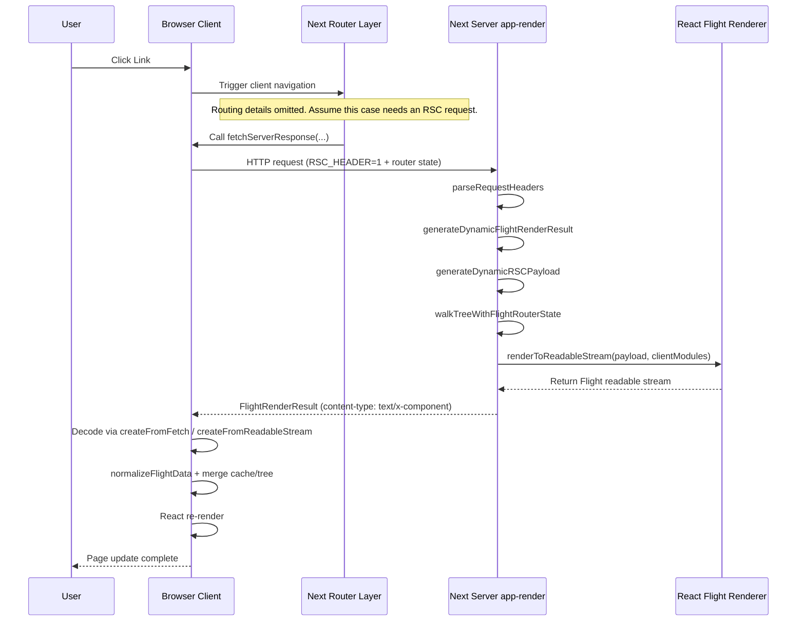
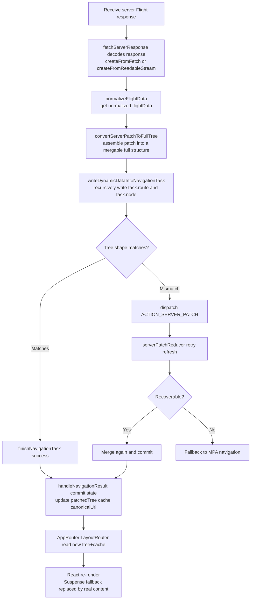
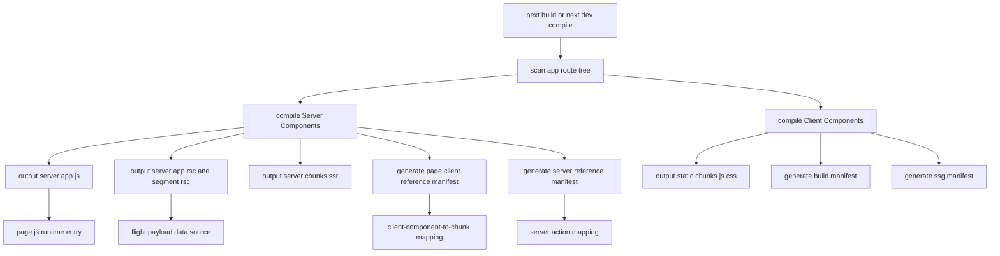

This article records some of my understanding and reflections while learning React Server Components (RSC).

Special thanks to Dan Abramov. Several of his posts were very helpful.

## What Are Server Components?

React's official docs define RSC roughly like this:

> Server Components are a new type of component that render ahead of time, in an environment separate from the client app or SSR server.
>
> The "server" in React Server Components refers to this separate environment. Server Components can run once at build time on your CI server, or run on every request on a web server.

Benefits:

1. Reduce JavaScript work on the client.
2. Faster first visible render.
3. Smaller transfer size by sending only necessary data and references.
4. Better SEO (crawler-friendly HTML output).
5. Move heavy computation to the server and keep the client lighter.
6. More natural server-side coordination of data fetching and rendering.
7. Coexist with CSR/SSR and support lower-cost progressive migration.

Below I use Next.js to discuss several key questions.

## After RSC, Can a Page Be "Pure HTML, No JS"?

It can be visible first, but not fully interactive by default. The key difference is hydration.

- **Initial HTML**: SSR/RSC can output HTML that is directly visible.
- **Hydration phase**: React attaches event handlers and state to existing DOM in the browser, making the page truly interactive.
- **No-JS scenario**: if client JS is not downloaded/executed, hydration never happens, and the page is usually readable but not fully interactive.

You can compare this to `renderToStaticMarkup` in `react-dom/server`: it outputs pure static HTML and **does not include hydratable metadata**, so it is naturally non-interactive. It fits scenarios like email templates and static landing pages.

So strictly speaking: **without JS, users can see content, but interactivity still needs client JS + hydration.**

## What Does RSC Build Output Look Like?

Traditional frontend/backend setups often have two separate programs. Frameworks like Next.js unify client and server builds in one project. With SSR/RSC enabled, build output is clearly split into two parts:

- Browser static assets: `.next/static/`
- Server runtime output: `.next/server/`

Using the default project from `bun create next-app@latest my-app --yes`, after `next build` the structure is roughly:

```text
my-app/.next
├── BUILD_ID
├── cache/
│   ├── .rscinfo
│   └── .tsbuildinfo
├── static/
│   ├── chunks/                  # browser JS/CSS
│   ├── media/                   # fonts/icons/static assets
│   └── <buildId>/               # _buildManifest / _ssgManifest
├── server/
│   ├── app/
│   │   ├── page.js              # server entry for /
│   │   ├── page_client-reference-manifest.js
│   │   ├── index.html           # SSR initial HTML
│   │   ├── index.rsc            # RSC Flight main payload
│   │   ├── index.segments/      # segmented RSC stream
│   │   ├── _global-error.rsc
│   │   └── _not-found.rsc
│   ├── chunks/
│   │   ├── [turbopack]_runtime.js
│   │   └── ssr/                 # server chunks (e.g. _6a2bd18a._.js)
│   └── server-reference-manifest.json
├── build/                       # internal build artifacts
├── types/                       # routes.d.ts, etc.
└── *-manifest.json              # route/build manifests
```

You will see non-traditional frontend artifacts such as `*.rsc` and `index.segments`. They are essentially **Flight data streams** (serialized React trees).

For example, `/.next/server/app/_not-found.rsc` looks like this:

```json
1:"$Sreact.fragment"
2:I[39756,["/_next/static/chunks/ff1a16fafef87110.js","/_next/static/chunks/d2be314c3ece3fbe.js"],"default"]
3:I[37457,["/_next/static/chunks/ff1a16fafef87110.js","/_next/static/chunks/d2be314c3ece3fbe.js"],"default"]
4:I[97367,["/_next/static/chunks/ff1a16fafef87110.js","/_next/static/chunks/d2be314c3ece3fbe.js"],"OutletBoundary"]
5:"$Sreact.suspense"
7:I[97367,["/_next/static/chunks/ff1a16fafef87110.js","/_next/static/chunks/d2be314c3ece3fbe.js"],"ViewportBoundary"]
9:I[97367,["/_next/static/chunks/ff1a16fafef87110.js","/_next/static/chunks/d2be314c3ece3fbe.js"],"MetadataBoundary"]
b:I[68027,["/_next/static/chunks/ff1a16fafef87110.js","/_next/static/chunks/d2be314c3ece3fbe.js"],"default"]
:HL["/_next/static/chunks/d05948bead110bdd.css","style"]
0:{"P":null,"b":"MR-NvVlPaQzLYhASCt1k2","c":["","_not-found"],"q":"","i":false,"f":[[["",{"children":["/_not-found",{"children":["__PAGE__",{}]}]},"$undefined","$undefined",true],[["$","$1","c",{"children":[[["$","link","0",{"rel":"stylesheet","href":"/_next/static/chunks/d05948bead110bdd.css","precedence":"next","crossOrigin":"$undefined","nonce":"$undefined"}]],["$","html",null,{"lang":"en","children":["$","body",null,{"className":"geist_a71539c9-module__T19VSG__variable geist_mono_8d43a2aa-module__8Li5zG__variable antialiased","children":["$","$L2",null,{"parallelRouterKey":"children","error":"$undefined","errorStyles":"$undefined","errorScripts":"$undefined","template":["$","$L3",null,{}],"templateStyles":"$undefined","templateScripts":"$undefined","notFound":[[["$","title",null,{"children":"404: This page could not be found."}],["$","div",null,{"style":{"fontFamily":"system-ui,\"Segoe UI\",Roboto,Helvetica,Arial,sans-serif,\"Apple Color Emoji\",\"Segoe UI Emoji\"","height":"100vh","textAlign":"center","display":"flex","flexDirection":"column","alignItems":"center","justifyContent":"center"},"children":["$","div",null,{"children":[[["$","style",null,{"dangerouslySetInnerHTML":{"__html":"body{color:#000;background:#fff;margin:0}.next-error-h1{border-right:1px solid rgba(0,0,0,.3)}@media (prefers-color-scheme:dark){body{color:#fff;background:#000}.next-error-h1{border-right:1px solid rgba(255,255,255,.3)}}"}}],["$","h1",null,{"className":"next-error-h1","style":{"display":"inline-block","margin":"0 20px 0 0","padding":"0 23px 0 0","fontSize":24,"fontWeight":500,"verticalAlign":"top","lineHeight":"49px"},"children":404}],["$","div",null,{"style":{"display":"inline-block"},"children":["$","h2",null,{"style":{"fontSize":14,"fontWeight":400,"lineHeight":"49px","margin":0},"children":"This page could not be found."}]}]]}]}]],[]],"forbidden":"$undefined","unauthorized":"$undefined"}]}]}]]}],{"children":[["$","$1","c",{"children":[null,["$","$L2",null,{"parallelRouterKey":"children","error":"$undefined","errorStyles":"$undefined","errorScripts":"$undefined","template":["$","$L3",null,{}],"templateStyles":"$undefined","templateScripts":"$undefined","notFound":"$undefined","forbidden":"$undefined","unauthorized":"$undefined"}]]}],{"children":[["$","$1","c",{"children":[[["$","title",null,{"children":"404: This page could not be found."}],["$","div",null,{"style":"$0:f:0:1:0:props:children:1:props:children:props:children:props:notFound:0:1:props:style","children":["$","div",null,{"children":[[["$","style",null,{"dangerouslySetInnerHTML":{"__html":"body{color:#000;background:#fff;margin:0}.next-error-h1{border-right:1px solid rgba(0,0,0,.3)}@media (prefers-color-scheme:dark){body{color:#fff;background:#000}.next-error-h1{border-right:1px solid rgba(255,255,255,.3)}}"}}],["$","h1",null,{"className":"next-error-h1","style":"$0:f:0:1:0:props:children:1:props:children:props:children:props:notFound:0:1:props:children:props:children:1:props:style","children":404}],["$","div",null,{"style":"$0:f:0:1:0:props:children:1:props:children:props:children:props:notFound:0:1:props:children:props:children:2:props:style","children":["$","h2",null,{"style":"$0:f:0:1:0:props:children:1:props:children:props:children:props:notFound:0:1:props:children:props:children:2:props:children:props:style","children":"This page could not be found."}]}]]}]}]],null,["$","$L4",null,{"children":["$","$5",null,{"name":"Next.MetadataOutlet","children":"$@6"}]}]]}],{},null,false,false]},null,false,false]},null,false,false],["$","$1","h",{"children":[[["$","meta",null,{"name":"robots","content":"noindex"}],["$","$L7",null,{"children":"$L8"}],["$","div",null,{"hidden":true,"children":["$","$L9",null,{"children":["$","$5",null,{"name":"Next.Metadata","children":"$La"}]}]}],["$","meta",null,{"name":"next-size-adjust","content":""}]]}],false]],"m":"$undefined","G":["$b","$undefined"],"S":true}
8:[["$","meta","0",{"charSet":"utf-8"}],["$","meta","1",{"name":"viewport","content":"width=device-width, initial-scale=1"}]]
c:I[27201,["/_next/static/chunks/ff1a16fafef87110.js","/_next/static/chunks/d2be314c3ece3fbe.js"],"IconMark"]
6:null
a:[["$","title","0",{"children":"Create Next App"}],["$","meta","1",{"name":"description","content":"Generated by create next app"}],["$","link","2",{"rel":"icon","href":"/favicon.ico?favicon.0b3bf435.ico","sizes":"256x256","type":"image/x-icon"}],["$","$Lc","3",{}]]
```

You can see:

- React symbols such as `"$Sreact.fragment"`.
- Element records such as `["$","div",null,...]`.
- Client asset references such as `/_next/static/chunks/*.js`.

This shows that RSC is not only "sending data". It sends **UI reconstruction structure + client module references**.

At the React repo level, the core implementation is split into:

- Serialization: [`packages/react-server`](https://github.com/facebook/react/tree/main/packages/react-server)
- Deserialization: [`packages/react-client`](https://github.com/facebook/react/tree/main/packages/react-client)

The `react-server` README mentions two codenames: **Fizz** and **Flight**. Next.js uses Flight-related implementation: [react-server-dom-webpack](https://github.com/facebook/react/tree/main/packages/react-server-dom-webpack)

These capabilities are open source, but they are not exposed to app developers as generic raw npm APIs. A key reason is that RSC is tightly coupled with bundler-specific module systems.

RSC must solve both:

1. How to resolve client modules when server components reference client components.
2. How the client gets the resources required for interactivity on initial load and later navigations.

> Hydration is the process where React attaches events and state to existing HTML so a page becomes interactive.

### Is Next.js More Like SPA or MPA?

Build output usually includes per-route HTML files, which looks MPA-like. But runtime navigation often uses client routing and Flight merging, rather than full-page reloads.

So I prefer this mental model: **MPA-like on first visit, SPA-like for in-app navigation.**

On route transitions, Next evaluates conditions like `content-type` (for example `text/x-component`), `res.ok`, and `buildId`; if not satisfied, it falls back to full-page navigation.

## How RSC Works at Runtime

Using `/` as an example, the flow can be simplified as:

1. Enter `page.js` and load server chunks through runtime.
2. Server outputs two categories: `index.html` (initial screen) and `index.rsc/index.segments/*` (Flight stream).
3. HTML injects `self.__next_f.push(...)` to inline Flight chunks.
4. Client uses `page_client-reference-manifest.js` to map client component references to concrete JS chunks.
5. If Server Actions are involved, `server-reference-manifest.json` is also used.

### Initial Load vs Subsequent Navigation

A concise summary of Next.js behavior:

Server phase:

1. Server Components are rendered into the RSC Payload special format.
2. Client Components and RSC Payload are then used together to pre-render HTML.

Initial load (client):

1. HTML gives users an immediate non-interactive preview.
2. RSC Payload reconciles server/client component trees.
3. JavaScript makes Client Components interactive.

Subsequent navigation:

1. RSC payloads are prefetched and cached for instant navigation.
2. Client Components are rendered entirely on the client without server-rendered HTML.

## A Typical Navigation Flow

When a user clicks Next `Link` and the target page needs extra RSC data, the flow is roughly:



The router side also checks first:

1. Whether it is a pure cache hit.
2. Whether an RSC request is needed.
3. Whether refresh/retry is needed, and whether to downgrade to MPA fallback.

A more detailed internal process can be represented as:



Important: **this subsequent navigation flow itself is usually not called hydration**.

- Hydration mainly happens after initial SSR HTML arrives.
- Later navigations are mostly Flight-driven tree updates and re-rendering.

## What Does `self.__next_f.push(...)` Actually Do?

You often see this in page HTML:

```html
<script>
  self.__next_f.push([1, "c:I[27201......"]);
</script>
```

In Next.js source, related implementation can be found at: `packages/next/src/server/app-render/use-flight-response.tsx`.

Its role can be summarized as: **inject server-generated RSC stream chunks into the browser, so the client can decode and update UI as chunks arrive.**

Process:

1. Server converts Flight data into streamed `<script>` chunks.
2. Client pre-initializes the `__next_f` consumer; each script execution enqueues chunks.
3. Runtime continuously consumes the queue and hands chunks to Flight decoder.
4. Router/cache merges patches and triggers boundary updates + re-renders.

At React level, the result is:

- `AppRouter` related context updates.
- `LayoutRouter` selects visible segments based on new `tree + cache`.
- Resolved Suspense boundaries replace fallbacks.
- Client Components with stable keys can retain local state.

## Why Doesn't RSC Just Use JSON?

A component tree can certainly be represented as JS objects and then sent as JSON. It sounds reasonable. But RSC chose a stream format with identifiers and tuple-like records.

Core reason: JSON is less convenient for "render UI while data is still arriving" scenarios.

On one hand, browsers usually need relatively complete JSON before stable `JSON.parse`. On the other hand, servers also tend to prepare a relatively complete structure before sending. Slow branches can delay overall usefulness.

If we loosely describe JSON transfer as depth-first expansion from top-level fields downward, any slow branch can block later display.

If we instead think in breadth-first style, using JSON-like notation:

```json
{ header: "$1", post: "$2", footer: "$3" }
```

RSC/Flight is closer to a chunk + placeholder-reference model.

`"$1"`, `"$2"`, `"$3"` represent chunks that will arrive later.
That means: send a structure skeleton first, then progressively fill in content.

- Data that arrives first can render first.
- Missing data stays suspended as placeholders (Promise/references).
- When data arrives, only related parts are unlocked and replaced.

You might ask: aren't components just HTML? Is this complexity necessary?
For purely static content, the difference is small.
But real pages contain many async data dependencies (essentially Promises). In that case, streaming transport alone is not enough; you also need a model for incomplete UI.

React models this with `<Suspense>`:

- Show fallback first.
- Reveal real content when data resolves.

So the core value of RSC payload is: **decouple data arrival order from UI presentation order**.

In addition, this format better expresses module references, shared subtrees, repeated structure reuse, and even circular references.

A simple example: the server passes a Promise to a client component, then `Suspense` is used with `use()`.

```tsx
"use client";
import { use, Suspense } from "react";

function Message({ messagePromise }) {
  const messageContent = use(messagePromise);
  return <p>Here is the message: {messageContent}</p>;
}

export function MessageContainer({ messagePromise }) {
  return (
    <Suspense fallback={<p>⌛Downloading message...</p>}>
      <Message messagePromise={messagePromise} />
    </Suspense>
  );
}
```

## Recommended Material for RSC Internals

If you want a systematic understanding of details around async components, client components, Server Actions, route updates, error handling, and binary data, I strongly recommend Dan Abramov's post and RSC Explorer:

- <https://overreacted.io/introducing-rsc-explorer/>
- <https://github.com/gaearon/rscexplorer>

<iframe style="width:100%;height:800px;border:1px solid #eee;border-radius:8px" src="https://rscexplorer.dev/embed.html?c=eyJzZXJ2ZXIiOiJpbXBvcnQgeyBDb3VudGVyIH0gZnJvbSAnLi9jbGllbnQnXG5cbmV4cG9ydCBkZWZhdWx0IGZ1bmN0aW9uIEFwcCgpIHtcbiAgcmV0dXJuIChcbiAgICA8ZGl2PlxuICAgICAgPGgxPkNvdW50ZXI8L2gxPlxuICAgICAgPENvdW50ZXIgaW5pdGlhbENvdW50PXswfSAvPlxuICAgIDwvZGl2PlxuICApXG59IiwiY2xpZW50IjoiJ3VzZSBjbGllbnQnXG5cbmltcG9ydCB7IHVzZVN0YXRlIH0gZnJvbSAncmVhY3QnXG5cbmV4cG9ydCBmdW5jdGlvbiBDb3VudGVyKHsgaW5pdGlhbENvdW50IH0pIHtcbiAgY29uc3QgW2NvdW50LCBzZXRDb3VudF0gPSB1c2VTdGF0ZShpbml0aWFsQ291bnQpXG5cbiAgcmV0dXJuIChcbiAgICA8ZGl2PlxuICAgICAgPHA%2BQ291bnQ6IHtjb3VudH08L3A%2BXG4gICAgICA8ZGl2IHN0eWxlPXt7IGRpc3BsYXk6ICdmbGV4JywgZ2FwOiA4IH19PlxuICAgICAgICA8YnV0dG9uIG9uQ2xpY2s9eygpID0%2BIHNldENvdW50KGMgPT4gYyAtIDEpfT7iiJI8L2J1dHRvbj5cbiAgICAgICAgPGJ1dHRvbiBvbkNsaWNrPXsoKSA9PiBzZXRDb3VudChjID0%2BIGMgKyAxKX0%2BKzwvYnV0dG9uPlxuICAgICAgPC9kaXY%2BXG4gICAgPC9kaXY%2BXG4gIClcbn0ifQ%3D%3D"></iframe>

## How RSC Gets Bundled

Using Next.js as an example, this can be abstracted as:



The key question in this diagram is: **how are server and client components actually separated?**

The core is two directives: `'use client'` and `'use server'`.
Their value is not just syntax markers. They push the client/server boundary into the module system.

- `'use client'` can be understood as "this module ends up in browser scripts", similar to the role of `<script>`.
- `'use server'` can be understood as "this function runs on the server and can be triggered by the client", similar to `fetch/RPC`.

This differs significantly from traditional CSR mental models.
Traditional CSR is often: write `fetch/xhr` manually in frontend components and process responses.
In RSC scenarios, many cross-environment calls are compiler-managed at module boundaries, and developers write more declarative component composition.

For example, if the server gets a Promise, it can pass it directly to a client component and consume it with `<Suspense>` + `use()`:

```tsx
"use client";
import { use, Suspense } from "react";

function Message({ messagePromise }) {
  const messageContent = use(messagePromise);
  return <p>Here is the message: {messageContent}</p>;
}

export function MessageContainer({ messagePromise }) {
  return (
    <Suspense fallback={<p>⌛Downloading message...</p>}>
      <Message messagePromise={messagePromise} />
    </Suspense>
  );
}
```

Why do RSC builds still depend on bundler bindings?
Because React itself does not know how modules should be transmitted and loaded by each concrete bundler. This part must be provided by bindings for Webpack / Parcel / (gradually improving) Vite. In React repo:

- `react-server-dom-webpack`
- `react-server-dom-parcel`

These bindings roughly do three things:

1. **Build time**: find `'use client'` entry points and emit client chunks.
2. **Server side**: tell React how to serialize module references into Flight data (for example `chunk123.js#Counter`).
3. **Client side**: tell React how to actually load those modules through bundler runtime.

Once these three parts are connected, React Server knows how to serialize module references, and React Client knows how to deserialize/load them.
In other words, RSC is not "data only". It is "data + module-reference protocol" working together.

## How to Understand "Shared Modules"

An RSC project looks like one codebase, but actually runs in two independent environments: server and browser.

The easiest misconception is `import`.

- `import` is not text copy-paste.
- In a single runtime, JS modules are singletons (same module usually initializes once).
- But if the same file is referenced by both server build and client build, each runtime gets its own instance.

That means a seemingly shared `utils.js` is actually **one module instance per environment**.

Conclusion:

1. RSC apps contain two module systems internally (server/client).
2. `import` brings code into the current runtime; it does not share memory across runtimes.

## References

1. Introducing RSC Explorer (Dan Abramov)
   <https://overreacted.io/introducing-rsc-explorer/>
2. Next.js `loading.js` File Convention (Docs)
   <https://nextjs.org/docs/app/api-reference/file-conventions/loading>
3. How do Server and Client Components work in Next.js? (Docs)
   <https://nextjs.org/docs/app/getting-started/server-and-client-components#how-do-server-and-client-components-work-in-nextjs>
4. How Imports Work in RSC (Dan Abramov)
   <https://overreacted.io/how-imports-work-in-rsc/>
