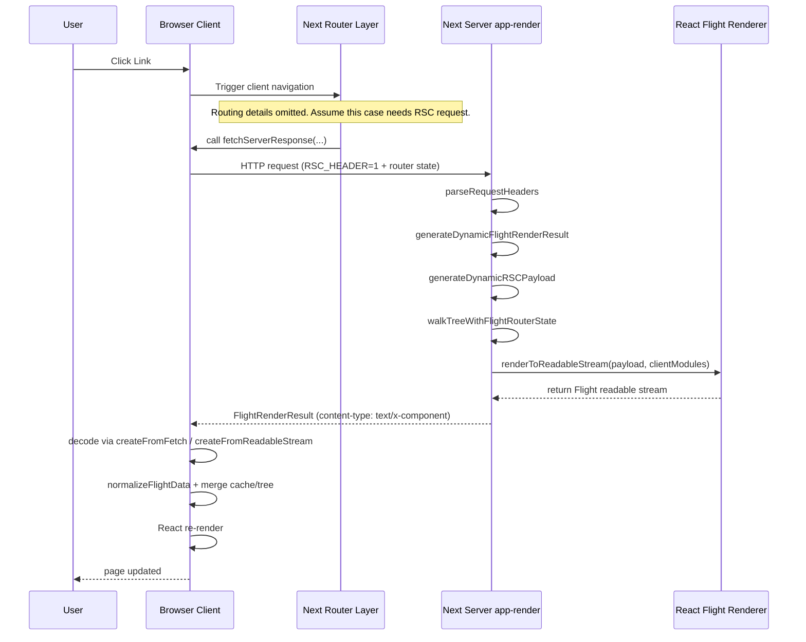
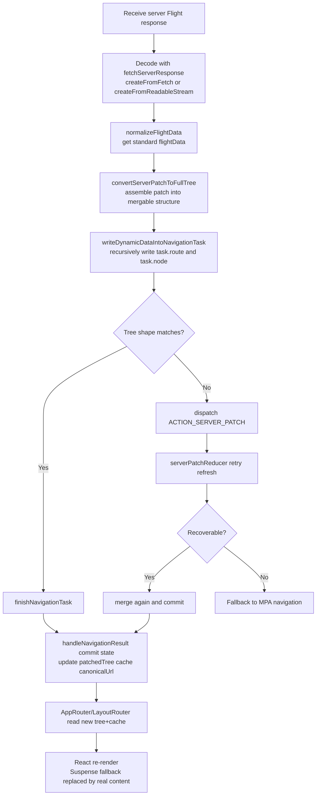

This article records my learning notes and reflections on React Server Components (RSC).

Special thanks to Dan Abramov. His writing helped me a lot.

## What Are Server Components?

React's official docs describe RSC roughly like this:

> Server Components are a new type of component that are rendered ahead of time before bundling, in an environment separate from your client app or SSR server.
> This separate environment is the "server" in React Server Components. Server Components can run once at build time (for example, in CI), or per request on a web server.

In one sentence: **RSC lets part of your component tree run only on the server, and sends the result (not the implementation details) to the browser.**

Common benefits:

1. Less JavaScript work on the client.
2. Faster first paint / first meaningful render.
3. Smaller transfer payloads (only necessary data and references).
4. Better SEO (crawler-friendly HTML output).
5. Heavy computation can move to the server.
6. Data fetching and rendering can be coordinated server-side.
7. Works with CSR/SSR in a progressive migration path.

Below, I use Next.js to walk through key questions.

## After RSC, Can a Page Be "Pure HTML" Without JS?

It can be visible, but not fully interactive. The key is hydration.

- **Initial HTML**: SSR/RSC can output HTML that renders immediately.
- **Hydration**: React attaches event handlers and state to existing DOM on the client, making it interactive.
- **No-JS scenario**: without downloading/executing client JS, hydration does not happen. The page is mostly read-only.

A useful comparison is `renderToStaticMarkup` from `react-dom/server`: it outputs static HTML **without hydration metadata**, so it's inherently non-interactive. It's suitable for emails or static content pages.

So, strictly speaking: **without JS, users can see content, but not fully use interactions.**

## What Does RSC Build Output Look Like?

Traditionally, frontend and backend are built as two separate programs. In a framework like Next.js, client and server builds are coordinated in one codebase. With SSR/RSC enabled, build output is clearly split into:

- browser static assets: `.next/static/`
- server runtime output: `.next/server/`

Using the default app from `bun create next-app@latest my-app --yes`, `next build` generates a structure like:

```text
my-app/.next
├── BUILD_ID
├── cache/
│   ├── .rscinfo
│   └── .tsbuildinfo
├── static/
│   ├── chunks/                  # browser JS/CSS
│   ├── media/                   # fonts/icons/static media
│   └── <buildId>/               # _buildManifest / _ssgManifest
├── server/
│   ├── app/
│   │   ├── page.js              # server entry for /
│   │   ├── page_client-reference-manifest.js
│   │   ├── index.html           # SSR initial HTML
│   │   ├── index.rsc            # RSC Flight main payload
│   │   ├── index.segments/      # segmented RSC stream
│   │   ├── _global-error.rsc
│   │   └── _not-found.rsc
│   ├── chunks/
│   │   ├── [turbopack]_runtime.js
│   │   └── ssr/                 # server chunks (e.g. _6a2bd18a._.js)
│   └── server-reference-manifest.json
├── build/                       # internal build artifacts
├── types/                       # routes.d.ts etc.
└── *-manifest.json              # route/build manifests
```

Files like `*.rsc` and `index.segments` are not typical in classic frontend-only builds. They are **Flight data streams** (serialized React tree payloads).

For example, `/.next/server/app/_not-found.rsc` may look like:

```rsc
1:"$Sreact.fragment"
2:I[39756,["/_next/static/chunks/ff1a16fafef87110.js","/_next/static/chunks/d2be314c3ece3fbe.js"],"default"]
3:I[37457,["/_next/static/chunks/ff1a16fafef87110.js","/_next/static/chunks/d2be314c3ece3fbe.js"],"default"]
4:I[97367,["/_next/static/chunks/ff1a16fafef87110.js","/_next/static/chunks/d2be314c3ece3fbe.js"],"OutletBoundary"]
5:"$Sreact.suspense"
7:I[97367,["/_next/static/chunks/ff1a16fafef87110.js","/_next/static/chunks/d2be314c3ece3fbe.js"],"ViewportBoundary"]
9:I[97367,["/_next/static/chunks/ff1a16fafef87110.js","/_next/static/chunks/d2be314c3ece3fbe.js"],"MetadataBoundary"]
b:I[68027,["/_next/static/chunks/ff1a16fafef87110.js","/_next/static/chunks/d2be314c3ece3fbe.js"],"default"]
:HL["/_next/static/chunks/d05948bead110bdd.css","style"]
0:{"P":null,"b":"MR-NvVlPaQzLYhASCt1k2","c":["","_not-found"],"q":"","i":false,"f":[[["",{"children":["/_not-found",{"children":["__PAGE__",{}]}]},"$undefined","$undefined",true],[[$","$1","c",{"children":[[["$","link","0",{"rel":"stylesheet","href":"/_next/static/chunks/d05948bead110bdd.css","precedence":"next","crossOrigin":"$undefined","nonce":"$undefined"}]],["$","html",null,{"lang":"en","children":["$","body",null,{"className":"geist_a71539c9-module__T19VSG__variable geist_mono_8d43a2aa-module__8Li5zG__variable antialiased","children":["$","$L2",null,{"parallelRouterKey":"children","error":"$undefined","errorStyles":"$undefined","errorScripts":"$undefined","template":["$","$L3",null,{}],"templateStyles":"$undefined","templateScripts":"$undefined","notFound":[[["$","title",null,{"children":"404: This page could not be found."}],["$","div",null,{"style":{"fontFamily":"system-ui,\"Segoe UI\",Roboto,Helvetica,Arial,sans-serif,\"Apple Color Emoji\",\"Segoe UI Emoji\"","height":"100vh","textAlign":"center","display":"flex","flexDirection":"column","alignItems":"center","justifyContent":"center"},"children":["$","div",null,{"children":[[["$","style",null,{"dangerouslySetInnerHTML":{"__html":"body{color:#000;background:#fff;margin:0}.next-error-h1{border-right:1px solid rgba(0,0,0,.3)}@media (prefers-color-scheme:dark){body{color:#fff;background:#000}.next-error-h1{border-right:1px solid rgba(255,255,255,.3)}}"}}],["$","h1",null,{"className":"next-error-h1","style":{"display":"inline-block","margin":"0 20px 0 0","padding":"0 23px 0 0","fontSize":24,"fontWeight":500,"verticalAlign":"top","lineHeight":"49px"},"children":404}],["$","div",null,{"style":{"display":"inline-block"},"children":["$","h2",null,{"style":{"fontSize":14,"fontWeight":400,"lineHeight":"49px","margin":0},"children":"This page could not be found."}]}]]}]}]],[]],"forbidden":"$undefined","unauthorized":"$undefined"}]}]}]]}],{"children":[["$","$1","c",{"children":[null,["$","$L2",null,{"parallelRouterKey":"children","error":"$undefined","errorStyles":"$undefined","errorScripts":"$undefined","template":["$","$L3",null,{}],"templateStyles":"$undefined","templateScripts":"$undefined","notFound":"$undefined","forbidden":"$undefined","unauthorized":"$undefined"}]]}],{"children":[["$","$1","c",{"children":[[["$","title",null,{"children":"404: This page could not be found."}],["$","div",null,{"style":"$0:f:0:1:0:props:children:1:props:children:props:children:props:notFound:0:1:props:style","children":["$","div",null,{"children":[[["$","style",null,{"dangerouslySetInnerHTML":{"__html":"body{color:#000;background:#fff;margin:0}.next-error-h1{border-right:1px solid rgba(0,0,0,.3)}@media (prefers-color-scheme:dark){body{color:#fff;background:#000}.next-error-h1{border-right:1px solid rgba(255,255,255,.3)}}"}}],["$","h1",null,{"className":"next-error-h1","style":"$0:f:0:1:0:props:children:1:props:children:props:children:props:notFound:0:1:props:children:props:children:1:props:style","children":404}],["$","div",null,{"style":"$0:f:0:1:0:props:children:1:props:children:props:children:props:notFound:0:1:props:children:props:children:2:props:style","children":["$","h2",null,{"style":"$0:f:0:1:0:props:children:1:props:children:props:children:props:notFound:0:1:props:children:props:children:2:props:children:props:style","children":"This page could not be found."}]}]]}]}]],null,["$","$L4",null,{"children":["$","$5",null,{"name":"Next.MetadataOutlet","children":"$@6"}]}]]}],{},null,false,false]},null,false,false]},null,false,false],["$","$1","h",{"children":[[["$","meta",null,{"name":"robots","content":"noindex"}],["$","$L7",null,{"children":"$L8"}],["$","div",null,{"hidden":true,"children":["$","$L9",null,{"children":["$","$5",null,{"name":"Next.Metadata","children":"$La"}]}]}],["$","meta",null,{"name":"next-size-adjust","content":""}]]}],false]],"m":"$undefined","G":["$b","$undefined"],"S":true}
8:[["$","meta","0",{"charSet":"utf-8"}],["$","meta","1",{"name":"viewport","content":"width=device-width, initial-scale=1"}]]
c:I[27201,["/_next/static/chunks/ff1a16fafef87110.js","/_next/static/chunks/d2be314c3ece3fbe.js"],"IconMark"]
6:null
a:[["$","title","0",{"children":"Create Next App"}],["$","meta","1",{"name":"description","content":"Generated by create next app"}],["$","link","2",{"rel":"icon","href":"/favicon.ico?favicon.0b3bf435.ico","sizes":"256x256","type":"image/x-icon"}],["$","$Lc","3",{}]]
```

You can spot:

- React symbols like `"$Sreact.fragment"`
- element records like `["$","div",null,...]`
- references to browser assets like `/_next/static/chunks/*.js`

So RSC is not only "sending data". It sends **UI reconstruction structure + client module references**.

At the React repo level, RSC internals map to:

- serialization: [`packages/react-server`](https://github.com/facebook/react/tree/main/packages/react-server)
- deserialization: [`packages/react-client`](https://github.com/facebook/react/tree/main/packages/react-client)

`react-server` mentions two codenames: **Fizz** and **Flight**. Next.js uses Flight-related implementation: <https://github.com/facebook/react/tree/main/packages/react-server-dom-webpack>

These internals are open-source, but they are not exposed to app code as generic raw npm APIs. One core reason: RSC is tightly integrated with bundler module systems.

Because RSC must solve both:

1. how server components reference client modules
2. how client runtime gets resources needed for interactivity

> Hydration is the process where React attaches events and state to existing HTML so the page becomes interactive.

### Is Next.js More SPA or MPA?

Build output looks MPA-ish because each route can have its own HTML file. Runtime navigation is SPA-ish because many transitions are client-side and patch with Flight rather than full reload.

So a practical mental model is: **MPA on first entry, SPA-like for in-app navigation.**

During navigation, Next checks things like `content-type` (for example `text/x-component`), `res.ok`, and `buildId`. If checks fail, it can fall back to full-page navigation.

## How RSC Works at Runtime

For `/`, a high-level chain looks like:

1. Enter `page.js`, load server chunks via runtime.
2. Server produces two outputs: `index.html` (initial screen) and `index.rsc/index.segments/*` (Flight stream).
3. HTML includes `self.__next_f.push(...)` to inline Flight chunks.
4. Client maps "client component references" to JS chunks via `page_client-reference-manifest.js`.
5. If Server Actions are involved, `server-reference-manifest.json` is used too.

### Initial Load vs Subsequent Navigation

You can summarize Next.js behavior this way:

Server side:

1. Server Components render into a special RSC Payload format.
2. Client Components + RSC Payload are used to pre-render HTML.

Initial load (client side):

1. HTML displays non-interactive content immediately.
2. RSC Payload reconciles server/client component trees.
3. JavaScript makes client components interactive.

Subsequent navigation:

1. If prefetch cache is complete, switch locally.
2. If extra data is needed, request Flight (`text/x-component`).

## A Typical Navigation Flow

When a user clicks a Next `Link` and target route needs extra RSC data, flow is roughly:



Router layer typically checks first:

1. pure cache hit or not
2. whether RSC request is required
3. whether refresh/retry is needed and whether to downgrade to MPA fallback

A more detailed internal path can be represented as:



Important: this subsequent navigation flow is usually **not** called hydration.

- Hydration mainly happens after initial SSR HTML arrives.
- Later navigation is mostly Flight-driven patching and re-rendering.

## What Does `self.__next_f.push(...)` Actually Do?

You often see this in page HTML:

```html
<script>
  self.__next_f.push([1, "c:I[27201......"]);
</script>
```

In Next.js source, related code is in `packages/next/src/server/app-render/use-flight-response.tsx`.

In short, it **injects server-generated RSC stream chunks into the browser, so the client can decode and update UI incrementally**.

Process:

1. Server converts Flight chunks into `<script>` fragments and streams them.
2. Client runtime initializes `__next_f` queue consumer.
3. Incoming entries are consumed continuously and fed into Flight decoder.
4. Router/cache merges patches and triggers boundary re-renders.

React-side effects:

- `AppRouter` context values update.
- `LayoutRouter` selects segments with new `tree + cache`.
- resolved Suspense boundaries replace fallback UI.
- client component local state can survive if keys/boundaries are stable.

## Why Not Just JSON for RSC?

At first glance, component trees can be represented as objects, so JSON seems enough. But JSON has two practical issues here:

1. Typical handling is closer to "wait for full payload, then parse".
2. It is weaker for progressive expression of async tree dependencies.

If transfer behaves like depth-first delivery, one slow branch can block useful rendering. RSC/Flight uses a model closer to "chunked records + placeholder references":

```text
{ header: "$1", post: "$2", footer: "$3" }
```

`"$1"`, `"$2"`, and `"$3"` can be filled later by subsequent chunks.

- Ready parts can render early.
- Pending parts stay suspended as placeholders/promises.
- When data arrives, only relevant boundaries unlock and update.

This aligns naturally with `<Suspense>`:

- show fallback first
- reveal real content when data resolves

Core value of RSC payload format: **decouple data arrival order from UI presentation order**.

It also better supports module references, subtree reuse, deduped repeated structures, and even circular references.

## Recommended Resources for RSC Internals

If you want deeper understanding of async components, client components, Server Actions, route updates, error handling, and binary data behavior, Dan Abramov's post and RSC Explorer are great:

- <https://overreacted.io/introducing-rsc-explorer/>
- <https://github.com/gaearon/rscexplorer>

<iframe style="width:100%;height:800px;border:1px solid #eee;border-radius:8px" src="https://rscexplorer.dev/embed.html?c=eyJzZXJ2ZXIiOiJpbXBvcnQgeyBDb3VudGVyIH0gZnJvbSAnLi9jbGllbnQnXG5cbmV4cG9ydCBkZWZhdWx0IGZ1bmN0aW9uIEFwcCgpIHtcbiAgcmV0dXJuIChcbiAgICA8ZGl2PlxuICAgICAgPGgxPkNvdW50ZXI8L2gxPlxuICAgICAgPENvdW50ZXIgaW5pdGlhbENvdW50PXswfSAvPlxuICAgIDwvZGl2PlxuICApXG59IiwiY2xpZW50IjoiJ3VzZSBjbGllbnQnXG5cbmltcG9ydCB7IHVzZVN0YXRlIH0gZnJvbSAncmVhY3QnXG5cbmV4cG9ydCBmdW5jdGlvbiBDb3VudGVyKHsgaW5pdGlhbENvdW50IH0pIHtcbiAgY29uc3QgW2NvdW50LCBzZXRDb3VudF0gPSB1c2VTdGF0ZShpbml0aWFsQ291bnQpXG5cbiAgcmV0dXJuIChcbiAgICA8ZGl2PlxuICAgICAgPHA+Q291bnQ6IHtjb3VudH08L3A+XG4gICAgICA8ZGl2IHN0eWxlPXt7IGRpc3BsYXk6ICdmbGV4JywgZ2FwOiA4IH19PlxuICAgICAgICA8YnV0dG9uIG9uQ2xpY2s9eygpID0+IHNldENvdW50KGMgPT4gYyAtIDEpfT7iiJI8L2J1dHRvbj5cbiAgICAgICAgPGJ1dHRvbiBvbkNsaWNrPXsoKSA9PiBzZXRDb3VudChjID0+IGMgKyAxKX0+KzwvYnV0dG9uPlxuICAgICAgPC9kaXY+XG4gICAgPC9kaXY+XG4gIClcbn0ifQ%3D%3D"></iframe>

## How RSC Is Bundled

In Next.js, you can abstract it as:


Server/client boundaries are mainly declared by directives: `'use client'` and `'use server'`.

- `'use client'`: module is bundled for client runtime (UI/events/state).
- `'use server'`: function is invokable from client, compiled into network calls by framework.

That makes cross-environment boundary part of the module system, so bundlers can decide:

1. what goes to browser bundle
2. what stays server-side
3. how to map references across environments

A simple example: pass a Promise from server side to a client component and consume it with `Suspense`.

```tsx
"use client";
import { use, Suspense } from "react";

function Message({ messagePromise }) {
  const messageContent = use(messagePromise);
  return <p>Here is the message: {messageContent}</p>;
}

export function MessageContainer({ messagePromise }) {
  return (
    <Suspense fallback={<p>⌛Downloading message...</p>}>
      <Message messagePromise={messagePromise} />
    </Suspense>
  );
}
```

## How to Think About "Shared Modules"

An RSC app looks like one codebase, but runs across two separate environments: server and browser.

A common misconception is `import`.

- `import` is not textual copy-paste.
- In one runtime, JS modules are singletons (initialized once per module graph).
- But if the same file is included in both server build and client build, each runtime gets its own instance.

So a "shared" `utils.js` is actually **one instance per environment**.

Conclusion:

1. RSC apps effectively contain two module systems (server/client).
2. `import` brings code into the current runtime, not shared memory across runtimes.

## References

1. Introducing RSC Explorer (Dan Abramov)
   <https://overreacted.io/introducing-rsc-explorer/>
2. Next.js `loading.js` File Convention (Docs)
   <https://nextjs.org/docs/app/api-reference/file-conventions/loading>
3. How do Server and Client Components work in Next.js? (Docs)
   <https://nextjs.org/docs/app/getting-started/server-and-client-components#how-do-server-and-client-components-work-in-nextjs>
4. How Imports Work in RSC (Dan Abramov)
   <https://overreacted.io/how-imports-work-in-rsc/>
