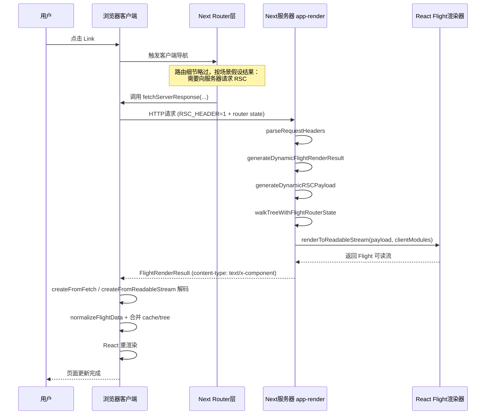
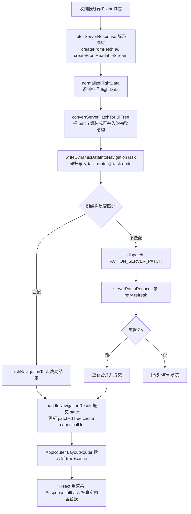
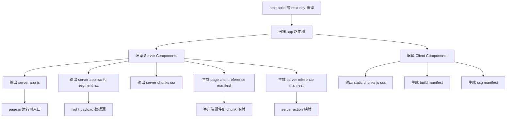

这篇文章记录我学习 React Server Components（下文简称 RSC）过程中的一些理解与思考。

特别感谢 Dan Abramov，他的几篇博客对我帮助很大。

## 服务器组件是什么

React 官方文档对 RSC 的定义大意如下：

> 服务器组件是一种在打包前预渲染的新型组件，运行环境与客户端应用或 SSR 服务器分离。这个独立环境就是 RSC 里的“服务器”。
> Server Components 既可以在构建时运行（例如 CI），也可以在请求时运行（Web 服务器）。

如果用一句话概括：**RSC 让一部分组件只在服务器执行，把“结果”而不是“实现”发送给浏览器。**

常见收益：

1. 减轻客户端 JavaScript 负担。
2. 更快的首屏可见速度。
3. 降低传输体积，只传必要数据与引用。
4. 更利于 SEO（返回可抓取的 HTML）。
5. 复杂计算转移到服务器，客户端更轻。
6. 数据获取与组件渲染在服务器侧协同更自然。
7. 能与 CSR/SSR 共存，渐进迁移成本更低。

下面结合 Next.js 来聊几个关键问题。

## RSC 后页面能否“纯 HTML、不要 JS”？

可以“先显示”，但默认不能“完整交互”。关键差异在于是否发生了水合（Hydration）。

- **首屏 HTML**：SSR/RSC 都能先输出可直接展示的 HTML。
- **水合阶段**：React 在浏览器把事件处理与状态挂到已有 DOM 上，页面才真正可交互。
- **无 JS 场景**：没有客户端下载与执行，就不会发生水合，页面通常只能阅读，不能进行完整交互。

这个区别可以和 `react-dom/server` 的 `renderToStaticMarkup` 对照理解：它会输出纯静态 HTML，**不会携带可水合的信息**，因此天然是不可交互的静态结果，更适合邮件模板、纯静态落地页等场景。

所以严格来说：**没有 JS 可以“看见内容”，但要“可交互”，仍需要客户端 JS + 水合。**

## RSC 打包产物长什么样

传统前后端通常是两套程序；而 Next.js 这类框架把客户端与服务端构建统一在一个工程里。启用 SSR/RSC 后，构建产物会明显分成两部分：

- 浏览器静态资源：`.next/static/`
- 服务端运行产物：`.next/server/`

以 `bun create next-app@latest my-app --yes` 的默认项目为例，`next build` 后目录大致如下：

```text
my-app/.next
├── BUILD_ID
├── cache/
│   ├── .rscinfo
│   └── .tsbuildinfo
├── static/
│   ├── chunks/                  # 浏览器 JS/CSS
│   ├── media/                   # 字体/图标等静态资源
│   └── <buildId>/               # _buildManifest / _ssgManifest
├── server/
│   ├── app/
│   │   ├── page.js              # / 路由服务端入口
│   │   ├── page_client-reference-manifest.js
│   │   ├── index.html           # SSR 首屏 HTML
│   │   ├── index.rsc            # RSC Flight 主 payload
│   │   ├── index.segments/      # 分段 RSC（流式）
│   │   ├── _global-error.rsc
│   │   └── _not-found.rsc
│   ├── chunks/
│   │   ├── [turbopack]_runtime.js
│   │   └── ssr/                 # 服务器端分块（如 _6a2bd18a._.js）
│   └── server-reference-manifest.json
├── build/                       # 构建阶段内部产物
├── types/                       # routes.d.ts 等
└── *-manifest.json              # 路由/构建清单
```

你会看到 `*.rsc`、`index.segments` 这类“非传统前端打包文件”。它们本质上是 **Flight 数据流**（即序列化后的 React 树）。

例如 `/.next/server/app/_not-found.rsc` 内容会类似这样：

```json
1:"$Sreact.fragment"
2:I[39756,["/_next/static/chunks/ff1a16fafef87110.js","/_next/static/chunks/d2be314c3ece3fbe.js"],"default"]
3:I[37457,["/_next/static/chunks/ff1a16fafef87110.js","/_next/static/chunks/d2be314c3ece3fbe.js"],"default"]
4:I[97367,["/_next/static/chunks/ff1a16fafef87110.js","/_next/static/chunks/d2be314c3ece3fbe.js"],"OutletBoundary"]
5:"$Sreact.suspense"
7:I[97367,["/_next/static/chunks/ff1a16fafef87110.js","/_next/static/chunks/d2be314c3ece3fbe.js"],"ViewportBoundary"]
9:I[97367,["/_next/static/chunks/ff1a16fafef87110.js","/_next/static/chunks/d2be314c3ece3fbe.js"],"MetadataBoundary"]
b:I[68027,["/_next/static/chunks/ff1a16fafef87110.js","/_next/static/chunks/d2be314c3ece3fbe.js"],"default"]
:HL["/_next/static/chunks/d05948bead110bdd.css","style"]
0:{"P":null,"b":"MR-NvVlPaQzLYhASCt1k2","c":["","_not-found"],"q":"","i":false,"f":[[["",{"children":["/_not-found",{"children":["__PAGE__",{}]}]},"$undefined","$undefined",true],[["$","$1","c",{"children":[[["$","link","0",{"rel":"stylesheet","href":"/_next/static/chunks/d05948bead110bdd.css","precedence":"next","crossOrigin":"$undefined","nonce":"$undefined"}]],["$","html",null,{"lang":"en","children":["$","body",null,{"className":"geist_a71539c9-module__T19VSG__variable geist_mono_8d43a2aa-module__8Li5zG__variable antialiased","children":["$","$L2",null,{"parallelRouterKey":"children","error":"$undefined","errorStyles":"$undefined","errorScripts":"$undefined","template":["$","$L3",null,{}],"templateStyles":"$undefined","templateScripts":"$undefined","notFound":[[["$","title",null,{"children":"404: This page could not be found."}],["$","div",null,{"style":{"fontFamily":"system-ui,\"Segoe UI\",Roboto,Helvetica,Arial,sans-serif,\"Apple Color Emoji\",\"Segoe UI Emoji\"","height":"100vh","textAlign":"center","display":"flex","flexDirection":"column","alignItems":"center","justifyContent":"center"},"children":["$","div",null,{"children":[[["$","style",null,{"dangerouslySetInnerHTML":{"__html":"body{color:#000;background:#fff;margin:0}.next-error-h1{border-right:1px solid rgba(0,0,0,.3)}@media (prefers-color-scheme:dark){body{color:#fff;background:#000}.next-error-h1{border-right:1px solid rgba(255,255,255,.3)}}"}}],["$","h1",null,{"className":"next-error-h1","style":{"display":"inline-block","margin":"0 20px 0 0","padding":"0 23px 0 0","fontSize":24,"fontWeight":500,"verticalAlign":"top","lineHeight":"49px"},"children":404}],["$","div",null,{"style":{"display":"inline-block"},"children":["$","h2",null,{"style":{"fontSize":14,"fontWeight":400,"lineHeight":"49px","margin":0},"children":"This page could not be found."}]}]]}]}]],[]],"forbidden":"$undefined","unauthorized":"$undefined"}]}]}]]}],{"children":[["$","$1","c",{"children":[null,["$","$L2",null,{"parallelRouterKey":"children","error":"$undefined","errorStyles":"$undefined","errorScripts":"$undefined","template":["$","$L3",null,{}],"templateStyles":"$undefined","templateScripts":"$undefined","notFound":"$undefined","forbidden":"$undefined","unauthorized":"$undefined"}]]}],{"children":[["$","$1","c",{"children":[[["$","title",null,{"children":"404: This page could not be found."}],["$","div",null,{"style":"$0:f:0:1:0:props:children:1:props:children:props:children:props:notFound:0:1:props:style","children":["$","div",null,{"children":[[["$","style",null,{"dangerouslySetInnerHTML":{"__html":"body{color:#000;background:#fff;margin:0}.next-error-h1{border-right:1px solid rgba(0,0,0,.3)}@media (prefers-color-scheme:dark){body{color:#fff;background:#000}.next-error-h1{border-right:1px solid rgba(255,255,255,.3)}}"}}],["$","h1",null,{"className":"next-error-h1","style":"$0:f:0:1:0:props:children:1:props:children:props:children:props:notFound:0:1:props:children:props:children:1:props:style","children":404}],["$","div",null,{"style":"$0:f:0:1:0:props:children:1:props:children:props:children:props:notFound:0:1:props:children:props:children:2:props:style","children":["$","h2",null,{"style":"$0:f:0:1:0:props:children:1:props:children:props:children:props:notFound:0:1:props:children:props:children:2:props:children:props:style","children":"This page could not be found."}]}]]}]}]],null,["$","$L4",null,{"children":["$","$5",null,{"name":"Next.MetadataOutlet","children":"$@6"}]}]]}],{},null,false,false]},null,false,false]},null,false,false],["$","$1","h",{"children":[[["$","meta",null,{"name":"robots","content":"noindex"}],["$","$L7",null,{"children":"$L8"}],["$","div",null,{"hidden":true,"children":["$","$L9",null,{"children":["$","$5",null,{"name":"Next.Metadata","children":"$La"}]}]}],["$","meta",null,{"name":"next-size-adjust","content":""}]]}],false]],"m":"$undefined","G":["$b","$undefined"],"S":true}
8:[["$","meta","0",{"charSet":"utf-8"}],["$","meta","1",{"name":"viewport","content":"width=device-width, initial-scale=1"}]]
c:I[27201,["/_next/static/chunks/ff1a16fafef87110.js","/_next/static/chunks/d2be314c3ece3fbe.js"],"IconMark"]
6:null
a:[["$","title","0",{"children":"Create Next App"}],["$","meta","1",{"name":"description","content":"Generated by create next app"}],["$","link","2",{"rel":"icon","href":"/favicon.ico?favicon.0b3bf435.ico","sizes":"256x256","type":"image/x-icon"}],["$","$Lc","3",{}]]
```

可以看到：

- `"$Sreact.fragment"` 这类 React 符号。
- `["$","div",null,...]` 这类元素描述。
- `/_next/static/chunks/*.js` 这类客户端资源引用。

这说明 RSC 不只是“传数据”，而是“传可重建 UI 的结构 + 客户端模块引用”。

RSC 的底层实现核心可以看 React 仓库两部分：

- 序列化：[`packages/react-server`](https://github.com/facebook/react/tree/main/packages/react-server)
- 反序列化：[`packages/react-client`](https://github.com/facebook/react/tree/main/packages/react-client)

`react-server` 的 README 提到两个代号：**Fizz** 和 **Flight**。Next.js 使用的是 Flight 相关实现，参见依赖 [react-server-dom-webpack](https://github.com/facebook/react/tree/main/packages/react-server-dom-webpack)

这些能力是开源的，但不会以“原始内部包”直接给业务当通用 npm API 使用。一个关键原因是：RSC 与具体 bundler 的模块系统集成高度相关。

因为 RSC 需要同时解决：

1. 服务器组件中引用客户端组件时，如何定位客户端模块。
2. 首屏和后续导航中，客户端如何拿到可交互所需资源。

> 水合（Hydration）是 React 把事件和状态附着到已有 HTML 上，让页面从“可见”变成“可交互”的过程。

### Next.js 更像 SPA 还是 MPA？

构建产物里每个路由通常都有独立 HTML，这看起来像 MPA；但运行时导航又大量走客户端路由与 Flight 合并，不总是整页刷新。

所以我更倾向于把它理解为：**首访偏 MPA，站内导航偏 SPA。**

当路由切换时，Next 会综合判断 `content-type`（如 `text/x-component`）、`res.ok`、`buildId` 等条件；不满足时会降级为整页跳转。

## RSC 在运行时如何工作

以 `/` 页面为例，可以粗看成这条链路：

1. 进入 `page.js`，通过 runtime 拉起服务端 chunk。
2. 服务端产出两类内容：`index.html`（首屏）和 `index.rsc/index.segments/*`（Flight 数据流）。
3. HTML 中会注入 `self.__next_f.push(...)`，用于内联传输 Flight chunk。
4. 客户端基于 `page_client-reference-manifest.js` 把“客户端组件引用”映射到具体 JS。
5. 如存在 Server Action，还会用到 `server-reference-manifest.json` 的映射。

### 首次加载与后续导航

Next.js 的官方描述可以整理为：

服务端阶段：

1. Server Components 渲染为 RSC Payload 的特殊数据格式。
2. Client Components 与 RSC Payload 共同用于预渲染 HTML。

首次加载（客户端）：

1. HTML 用于立即向用户快速显示路线的非交互式预览。
2. RSC Payload 用于协调服务端/客户端组件树。
3. JavaScript 用于为客户端组件注入数据，使应用程序具有交互性。

后续导航：

1. RSC有效载荷已预先获取并缓存，以便即时导航。
2. 客户端组件完全在客户端渲染，无需服务器端渲染 HTML。

## 一个典型导航流程

当用户点击 Next 的 `Link`，且目标页需要补充 RSC 数据时，流程可近似为：



路由侧还会先判断：

1. 是否纯缓存命中。
2. 是否需要请求 RSC。
3. 是否需要 refresh/retry，必要时是否降级 MPA。

对应一次更细的内部处理可以表示为：



需要强调：**这段后续导航流程本身通常不叫“水合”。**

- 水合主要发生在首屏 SSR HTML 到达后。
- 后续导航更多是 Flight 数据驱动的树更新与重渲染。

## `self.__next_f.push(...)` 到底在做什么

你在页面中常看到：

```html
<script>
  self.__next_f.push([1, "c:I[27201......"]);
</script>
```

在 Next.js 仓库里可搜到相关实现：`packages/next/src/server/app-render/use-flight-response.tsx`。

它的作用可以概括为：**把服务端生成的 RSC 流按 chunk 注入浏览器，客户端边收边解码边更新 UI。**

过程如下：

1. 服务端把 Flight 数据转成一段段 `<script>` 并输出。
2. 客户端提前挂好 `__next_f` 消费器，脚本执行即入队。
3. 运行时持续消费队列，交给 Flight 解码器还原 payload。
4. Router/Cache 合并 patch，触发边界更新与重渲染。

React 层的结果是：

- `AppRouter` 相关 context 更新。
- `LayoutRouter` 基于新 `tree + cache` 选择要显示的 segment。
- 已 resolve 的 Suspense 边界替换 fallback。
- 未被替换 key 的 Client Components 可保留本地状态。

## RSC 为什么不是直接用 JSON

直觉上，组件树能表示为对象，似乎用 JSON 就够了。但 JSON 有两个问题：

1. 常见处理方式偏“整体到齐再解析”。
2. 对树状异步依赖的渐进表达能力不足。

如果把传输看成“深度优先”，任何慢节点都可能拖慢整体可用时间。RSC/Flight 采用的是一种更接近“分块 + 引用占位”的方式：

```text
{ header: "$1", post: "$2", footer: "$3" }
```

其中 `"$1"`、`"$2"`、`"$3"` 可在后续流里逐步补齐。这样：

- 先到的数据可先渲染。
- 未到的数据以占位（Promise/引用）挂起。
- 到达后再局部解锁并替换。

这与 `<Suspense>` 的模型天然契合：

- 先显示 fallback。
- 数据到达后局部恢复真实内容。

因此 RSC payload 的核心价值是：**把“数据到达顺序”和“UI 呈现顺序”解耦。**

此外，这种格式也更容易表达模块引用、共享子树、重复结构复用，甚至循环引用场景。

一个简单例子：服务器拿到 Promise，传给客户端组件，再配合 `Suspense` 使用。

```tsx
"use client";
import { use, Suspense } from "react";

function Message({ messagePromise }) {
  const messageContent = use(messagePromise);
  return <p>Here is the message: {messageContent}</p>;
}

export function MessageContainer({ messagePromise }) {
  return (
    <Suspense fallback={<p>⌛Downloading message...</p>}>
      <Message messagePromise={messagePromise} />
    </Suspense>
  );
}
```

## RSC 底层原理推荐资料

如果你想系统理解“异步组件、客户端组件、Server Action、路由更新、错误处理、二进制数据”的细节，强烈建议看 Dan Abramov 的文章和 RSC Explorer：

- <https://overreacted.io/introducing-rsc-explorer/>
- <https://github.com/gaearon/rscexplorer>

<iframe style="width:100%;height:800px;border:1px solid #eee;border-radius:8px" src="https://rscexplorer.dev/embed.html?c=eyJzZXJ2ZXIiOiJpbXBvcnQgeyBDb3VudGVyIH0gZnJvbSAnLi9jbGllbnQnXG5cbmV4cG9ydCBkZWZhdWx0IGZ1bmN0aW9uIEFwcCgpIHtcbiAgcmV0dXJuIChcbiAgICA8ZGl2PlxuICAgICAgPGgxPkNvdW50ZXI8L2gxPlxuICAgICAgPENvdW50ZXIgaW5pdGlhbENvdW50PXswfSAvPlxuICAgIDwvZGl2PlxuICApXG59IiwiY2xpZW50IjoiJ3VzZSBjbGllbnQnXG5cbmltcG9ydCB7IHVzZVN0YXRlIH0gZnJvbSAncmVhY3QnXG5cbmV4cG9ydCBmdW5jdGlvbiBDb3VudGVyKHsgaW5pdGlhbENvdW50IH0pIHtcbiAgY29uc3QgW2NvdW50LCBzZXRDb3VudF0gPSB1c2VTdGF0ZShpbml0aWFsQ291bnQpXG5cbiAgcmV0dXJuIChcbiAgICA8ZGl2PlxuICAgICAgPHA%2BQ291bnQ6IHtjb3VudH08L3A%2BXG4gICAgICA8ZGl2IHN0eWxlPXt7IGRpc3BsYXk6ICdmbGV4JywgZ2FwOiA4IH19PlxuICAgICAgICA8YnV0dG9uIG9uQ2xpY2s9eygpID0%2BIHNldENvdW50KGMgPT4gYyAtIDEpfT7iiJI8L2J1dHRvbj5cbiAgICAgICAgPGJ1dHRvbiBvbkNsaWNrPXsoKSA9PiBzZXRDb3VudChjID0%2BIGMgKyAxKX0%2BKzwvYnV0dG9uPlxuICAgICAgPC9kaXY%2BXG4gICAgPC9kaXY%2BXG4gIClcbn0ifQ%3D%3D"></iframe>

## RSC 是如何被打包的

以 Next.js 为例，可抽象成：



服务端/客户端边界主要依赖指令：`'use client'` 与 `'use server'`。

- `'use client'`：声明该模块要被客户端打包和执行（UI/事件/状态）。
- `'use server'`：声明可从客户端触发的服务端函数（由框架转换为网络调用）。

这让“跨端边界”进入模块系统，构建器才能准确决定：

1. 哪些代码进浏览器包。
2. 哪些代码留在服务器。
3. 如何建立两端引用映射。

## “公共模块”怎么理解

RSC 工程看起来是一套代码，实际上运行在两个独立环境：服务器和浏览器。

这里最容易误解的是 `import`。

- `import` 不是“文本复制粘贴”。
- JS 模块在单一运行时里是单例（同模块通常只初始化一次）。
- 但当同一文件被“服务端构建”和“客户端构建”都引用时，会在两个运行时各有一份实例。

也就是说，“看起来共享”的 `utils.js`，本质上是**两端各自的一份模块实例**。

结论：

1. RSC 应用内部存在两个模块系统（server/client）。
2. `import` 会把代码引入当前执行环境，而不是跨环境共享内存。

## 参考资料

1. Introducing RSC Explorer（Dan Abramov）
   <https://overreacted.io/introducing-rsc-explorer/>
2. Next.js `loading.js` File Convention（官方文档）
   <https://nextjs.org/docs/app/api-reference/file-conventions/loading>
3. How do Server and Client Components work in Next.js?（官方文档）
   <https://nextjs.org/docs/app/getting-started/server-and-client-components#how-do-server-and-client-components-work-in-nextjs>
4. How Imports Work in RSC（Dan Abramov）
   <https://overreacted.io/how-imports-work-in-rsc/>
